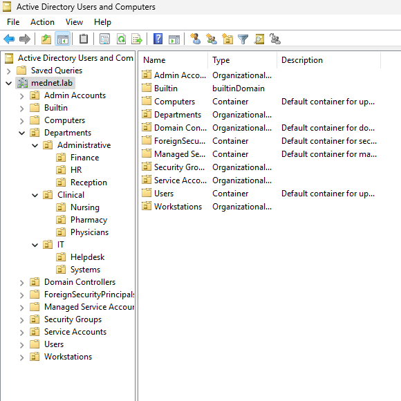
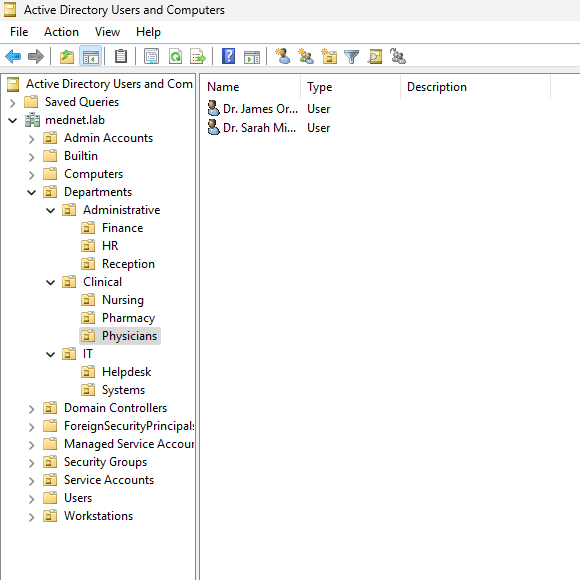

# Domain Design

## Overview

This document covers the Active Directory domain design for the MedNet Enterprise Lab, including the domain configuration, OU structure, naming conventions, and user account model. The design simulates a realistic hospital IT environment to reflect real-world healthcare infrastructure standards.

---

## Domain Configuration

| Setting | Value |
|---|---|
| Domain Name | `mednet.lab` |
| Domain Controller | `dc01` |
| DC Role | Global Catalog |
| AD Site | Default-First-Site-Name |
| Forest/Domain Functional Level | Windows Server 2016+ |

---

## OU Structure

Custom organizational units are created at the domain root, separate from the default AD containers (`Users`, `Computers`, `Builtin`). This keeps managed objects clearly distinct from the built-in containers and provides clean, scoped link points for Group Policy. All user accounts, computer objects, service accounts, and security groups are organized within this hierarchy.

```
mednet.lab
├── Admin Accounts
├── Departments
│   ├── Administrative
│   │   ├── Finance
│   │   ├── HR
│   │   └── Reception
│   ├── Clinical
│   │   ├── Nursing
│   │   ├── Pharmacy
│   │   └── Physicians
│   └── IT
│       ├── Helpdesk
│       └── Systems
├── Security Groups
├── Service Accounts
└── Workstations
    ├── Computers
    └── Servers
```

### OU Design Rationale

| OU | Purpose |
|---|---|
| `Departments` | Contains all standard user accounts, organized by role. Primary GPO link point for department-scoped user policies. |
| `Admin Accounts` | Holds privileged accounts (Domain Admins, Helpdesk Admins) separate from standard users — enforces least-privilege separation. |
| `Security Groups` | Centralized location for all custom security groups used in RBAC and resource access delegation. |
| `Service Accounts` | Dedicated OU for application service accounts (osTicket, Zabbix, Wazuh). Prevents service accounts from being mixed with user objects. |
| `Workstations` | Holds domain-joined computer objects. Split into `Computers` (endpoints) and `Servers` to allow machine-level GPOs to be scoped appropriately. |

> **Note:** The `Workstations` parent OU was named as such because `Computers` is a reserved default container in Active Directory and cannot be reused as an OU name at the domain root level.

---

## Screenshots

### Full Domain Structure

The following screenshot shows the complete OU hierarchy as viewed in Active Directory Users and Computers, with all custom OUs visible alongside the default AD containers.



### Populated Department OU — Clinical/Physicians

The following screenshot shows the `Physicians` sub-OU populated with representative user accounts, demonstrating how department OUs are used to organize users by role.



---

## Naming Conventions

### User Accounts

| Convention | Format | Example |
|---|---|---|
| Username | `firstname.lastname` | `s.mitchell` |
| Display Name | `Firstname Lastname` | `Sarah Mitchell` |
| Clinical titles | Included in display name only | `Dr. Sarah Mitchell` |

The `firstname.lastname` format is standard in healthcare IT environments and aligns with common UPN patterns (`s.mitchell@mednet.lab`).

### Representative User Accounts

The following test accounts are distributed across department OUs to simulate a realistic hospital staff structure:

| Display Name | Username | OU Path |
|---|---|---|
| Dr. Sarah Mitchell | s.mitchell | Departments/Clinical/Physicians |
| Dr. James Ortega | j.ortega | Departments/Clinical/Physicians |
| Lisa Nguyen | l.nguyen | Departments/Clinical/Nursing |
| Mark Evans | m.evans | Departments/Clinical/Pharmacy |
| Karen Booth | k.booth | Departments/Administrative/HR |
| Tom Reyes | t.reyes | Departments/Administrative/Finance |
| Dana Cole | d.cole | Departments/Administrative/Reception |
| Alex Turner | a.turner | Departments/IT/Helpdesk |

### Computer Objects

| Type | Format | Example |
|---|---|---|
| Workstations | `WS-DEPT-##` | `WS-CLIN-01` |
| Servers | `MEDNET-<ROLE>` | `MEDNET-FS01` |

Workstations use a `WS-DEPT-##` pattern tying each endpoint to its department (`WS-CLIN-01`, `WS-ADMIN-01`, `WS-IT-01`). Servers use a `MEDNET-<ROLE>` pattern identifying their function (`MEDNET-FS01` file server, `MEDNET-NOC` monitoring, `MEDNET-OSTICKET` ITSM, `MEDNET-SIEM01` SIEM). All computer objects are placed in the appropriate `Workstations/Computers` or `Workstations/Servers` sub-OU on domain join.

### Service Accounts

| Type | Format | Example |
|---|---|---|
| Service Accounts | `svc_appname` | `svc_osticket` |

Service accounts follow a `svc_` prefix to distinguish them clearly from standard user accounts in logs and audit reports, and are placed in the `Service Accounts` OU.

---

## Security Groups

All custom security groups are located in `OU=Security Groups,DC=mednet,DC=lab`. Groups follow a `Department-Role` naming convention and are used for RBAC across domain-joined resources including the Samba file server.

### Department Security Groups

| Group Name | Scope | Members | Purpose |
|---|---|---|---|
| `Clinical-Physicians` | Global / Security | s.mitchell, j.ortega | Access to `physicians` file share |
| `Clinical-Nursing` | Global / Security | l.nguyen | Access to `nursing` file share |
| `Clinical-Pharmacy` | Global / Security | m.evans | Access to `pharmacy` file share |
| `Admin-HR` | Global / Security | k.booth | Access to `hr` file share |
| `Admin-Finance` | Global / Security | t.reyes | Access to `finance` file share |
| `Admin-Reception` | Global / Security | d.cole | Access to `reception` file share |
| `IT-Staff` | Global / Security | a.turner | Access to `it` file share |

Groups were created using PowerShell on the domain controller:

```powershell
New-ADGroup -Name "Clinical-Physicians" -GroupScope Global -GroupCategory Security -Path "OU=Security Groups,DC=mednet,DC=lab"
New-ADGroup -Name "Clinical-Nursing" -GroupScope Global -GroupCategory Security -Path "OU=Security Groups,DC=mednet,DC=lab"
New-ADGroup -Name "Clinical-Pharmacy" -GroupScope Global -GroupCategory Security -Path "OU=Security Groups,DC=mednet,DC=lab"
New-ADGroup -Name "Admin-HR" -GroupScope Global -GroupCategory Security -Path "OU=Security Groups,DC=mednet,DC=lab"
New-ADGroup -Name "Admin-Finance" -GroupScope Global -GroupCategory Security -Path "OU=Security Groups,DC=mednet,DC=lab"
New-ADGroup -Name "Admin-Reception" -GroupScope Global -GroupCategory Security -Path "OU=Security Groups,DC=mednet,DC=lab"
New-ADGroup -Name "IT-Staff" -GroupScope Global -GroupCategory Security -Path "OU=Security Groups,DC=mednet,DC=lab"
```

Users were assigned to their groups:

```powershell
Add-ADGroupMember -Identity "Clinical-Physicians" -Members "s.mitchell","j.ortega"
Add-ADGroupMember -Identity "Clinical-Nursing" -Members "l.nguyen"
Add-ADGroupMember -Identity "Clinical-Pharmacy" -Members "m.evans"
Add-ADGroupMember -Identity "Admin-HR" -Members "k.booth"
Add-ADGroupMember -Identity "Admin-Finance" -Members "t.reyes"
Add-ADGroupMember -Identity "Admin-Reception" -Members "d.cole"
Add-ADGroupMember -Identity "IT-Staff" -Members "a.turner"
```

These global security groups are referenced by the domain-local resource permissions on the Samba file server, following standard AD role-based access control practice.

---

## Domain-Joined Computers

All lab servers and workstations are joined to the domain and sorted into their appropriate sub-OUs under `Workstations`:

| Computer Name | Role | OU Location | Status |
|---|---|---|---|
| `dc01` | Domain Controller | `Domain Controllers` | Active |
| `MEDNET-FS01` | File Server (Debian 12 / Samba) | `Workstations/Servers` | Active |
| `MEDNET-NOC` | Network Monitoring (Ubuntu Server / Zabbix) | `Workstations/Servers` | Active |
| `MEDNET-OSTICKET` | ITSM Platform (Debian / osTicket) | `Workstations/Servers` | Active |
| `MEDNET-SIEM01` | SIEM / HIDS (Rocky Linux 9 / Wazuh) | `Workstations/Servers` | Active |
| `WS-CLIN-01` | Clinical Workstation (Windows 11 Enterprise) | `Workstations/Computers` | Active |
| `WS-ADMIN-01` | Administrative Workstation (Windows 10 LTSC 2021) | `Workstations/Computers` | Active |
| `WS-IT-01` | IT Workstation (Ubuntu 24.04 Desktop) | `Workstations/Computers` | Active |

Placing the servers under `Workstations/Servers` (rather than leaving them in the default `Computers` container) is what allows server-scoped and endpoint-scoped machine GPOs to apply correctly, since GPOs cannot be linked to the default `Computers` container.

---

## GPO Delegation

Each `Departments` sub-OU serves as a link point for user-side policy (screen-lock timeouts, Control Panel and command-prompt restrictions). The `Workstations/Computers` OU is the link point for computer-side policy (removable-storage control, Windows Firewall, audit, and event-log settings) that applies to the domain-joined endpoints. Department-scoped and endpoint-scoped policy assignments are covered in detail in [02-gpo-configuration.md](02-gpo-configuration.md).

The `Workstations` split between `Computers` and `Servers` allows machine-level GPOs to be targeted at endpoints without affecting server objects.

---

## Related Documents

| Document | Description |
|---|---|
| [02-gpo-configuration.md](02-gpo-configuration.md) | GPO design, settings, and enforcement details |
| [03-pki-and-ldaps.md](03-pki-and-ldaps.md) | Internal CA setup, certificate deployment, LDAPS configuration |
| [04-security-hardening.md](04-security-hardening.md) | Account policies, audit configuration, event forwarding |
