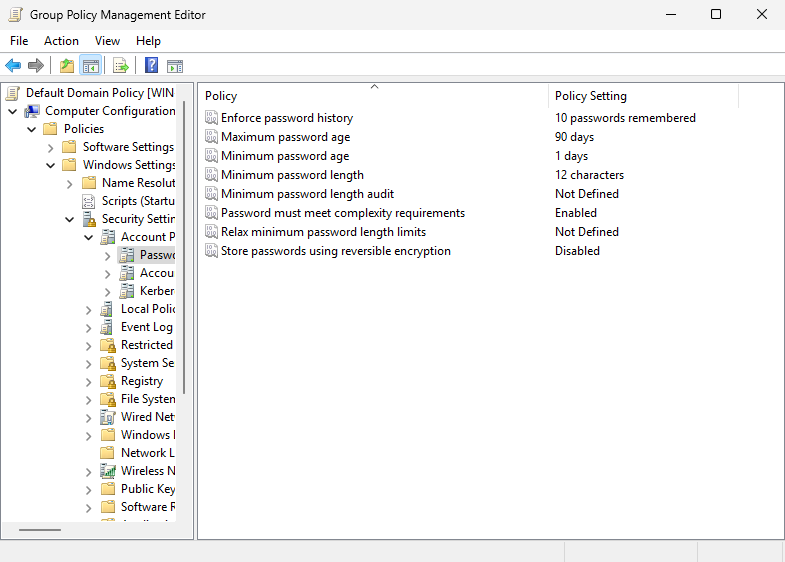
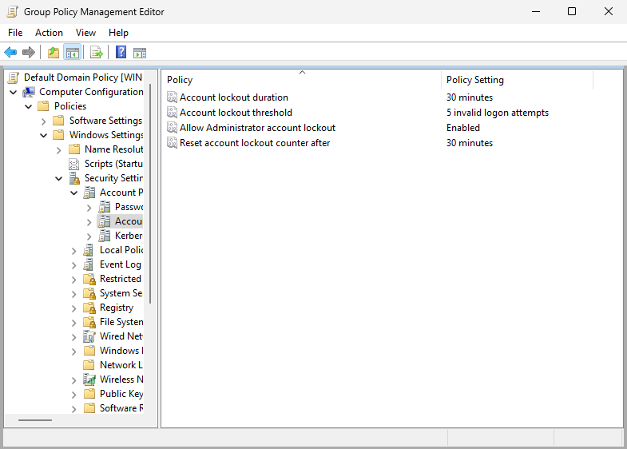
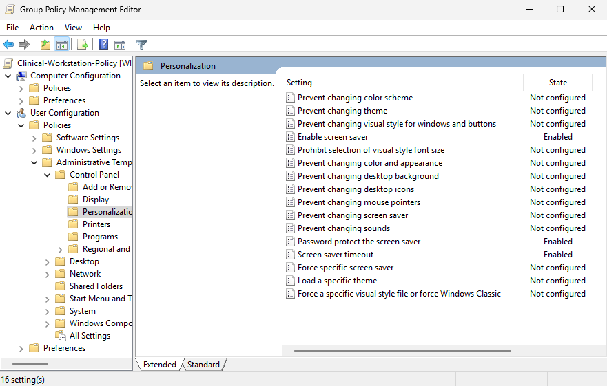
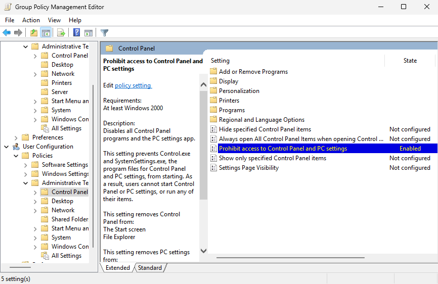
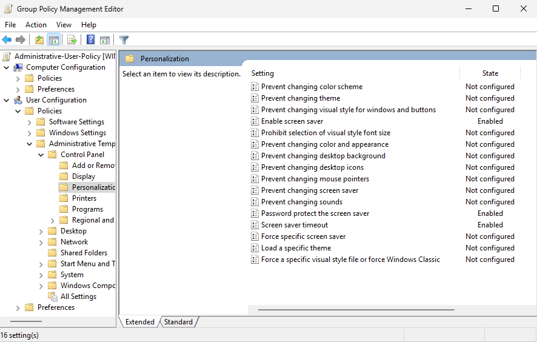
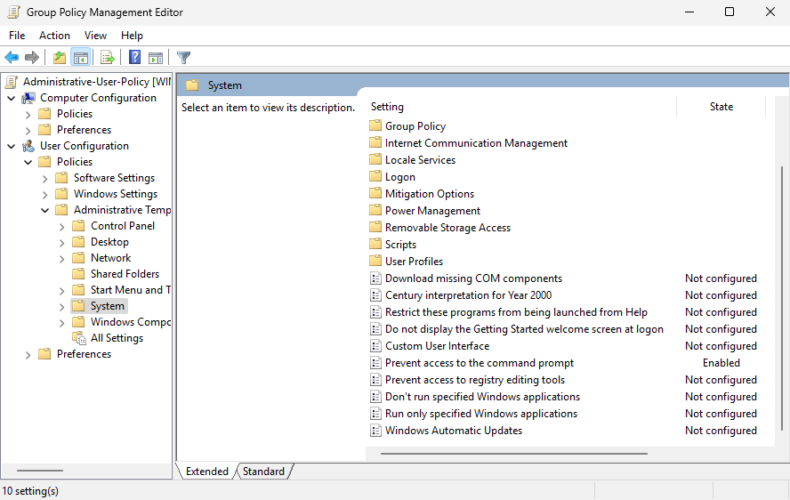
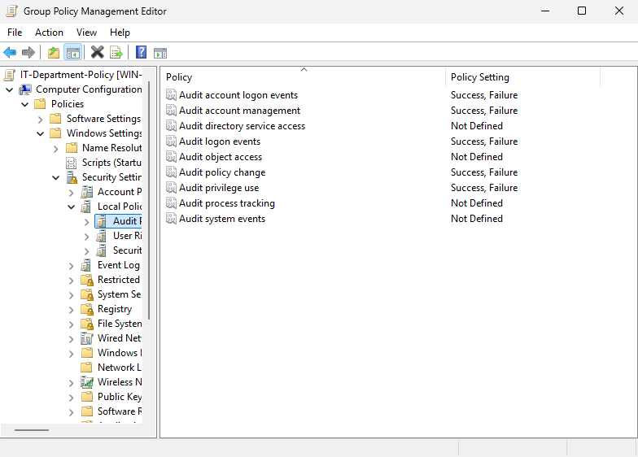
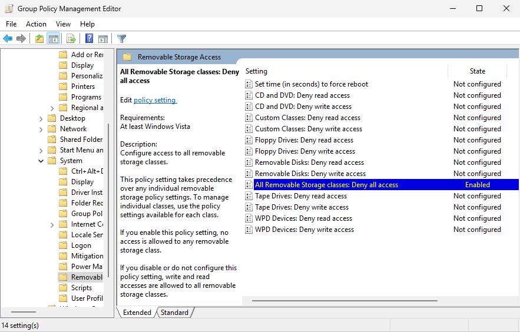
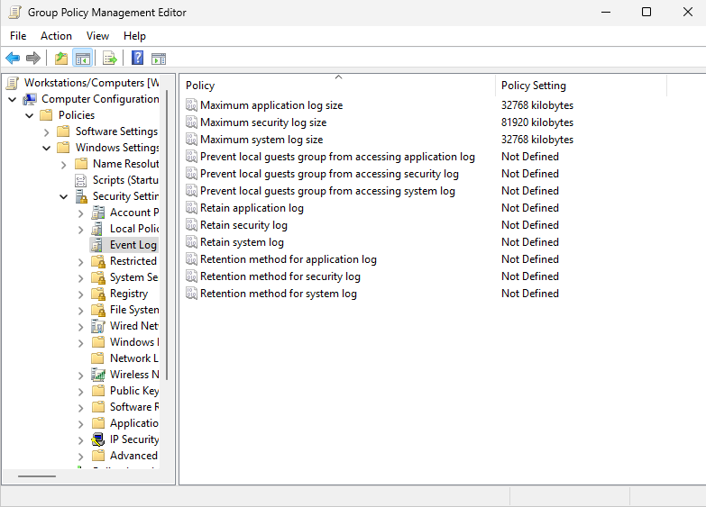
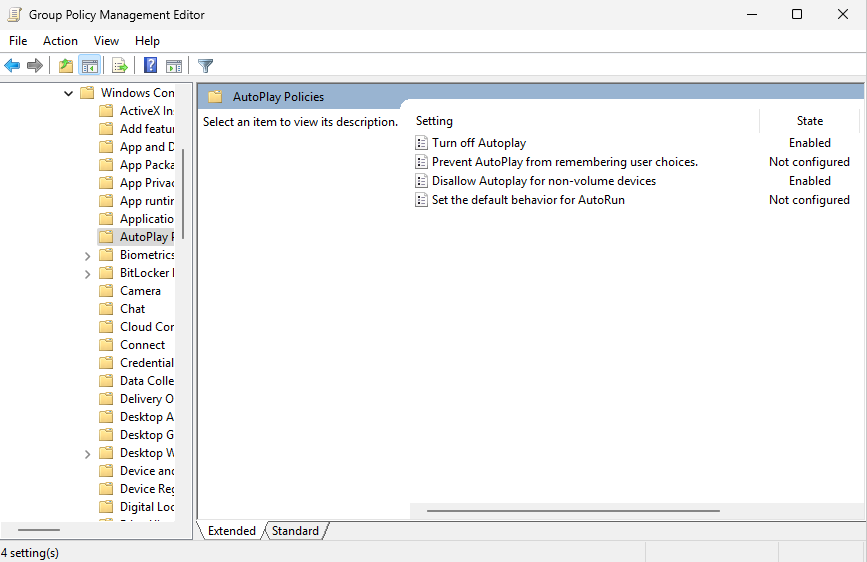

# GPO Configuration

## Overview

This document covers the Group Policy Object (GPO) design and configuration for the MedNet Enterprise Lab. Five GPOs are implemented across the domain to enforce security baselines, simulate healthcare compliance requirements (HIPAA), and demonstrate layered policy design across different OU scopes.

---

## Scoping Principle

Group Policy applies settings based on the type of object in the linked OU's scope. The two configuration sides target different objects:

- **User Configuration** settings (screen-saver timeout, Control Panel and command-prompt restrictions) are linked to the **`Departments`** OUs, which contain the **user accounts**. These follow the user.
- **Computer Configuration** settings (removable-storage control, Windows Firewall, Autoplay, audit policy, event-log sizing) are linked to **`Workstations/Computers`**, which contains the **machine objects**. These follow the endpoint.

This separation ensures each setting applies to the object type it actually targets — a computer-side setting linked only to a user OU would never reach the endpoints. The domain controller's own audit configuration is provided by the built-in **`Default Domain Controllers Policy`**, independent of the endpoint policies below.

---

## GPO Summary

| GPO Name | Linked To | Configuration Side | Scope |
|---|---|---|---|
| Default Domain Policy | `mednet.lab` (domain root) | Computer | All users and computers — password & lockout |
| Clinical-Workstation-Policy | `Departments/Clinical` | User | Clinical staff users |
| Administrative-User-Policy | `Departments/Administrative` | User | Administrative staff users |
| IT-Department-Policy | `Workstations/Computers` | Computer | Endpoint audit policy |
| Workstation-Baseline-Policy | `Workstations/Computers` | Computer | Endpoint hardening baseline |

---

## GPO #1 — Default Domain Policy (Password & Lockout)

The Default Domain Policy is configured at the domain root and applies to all user accounts in `mednet.lab`. It enforces the baseline password and account lockout standards required across the organization.

### Password Policy Settings

| Setting | Value |
|---|---|
| Enforce password history | 10 passwords remembered |
| Maximum password age | 90 days |
| Minimum password age | 1 day |
| Minimum password length | 12 characters |
| Password must meet complexity requirements | Enabled |
| Store passwords using reversible encryption | Disabled |

### Account Lockout Settings

| Setting | Value |
|---|---|
| Account lockout threshold | 5 invalid logon attempts |
| Account lockout duration | 30 minutes |
| Reset account lockout counter after | 30 minutes |
| Allow Administrator account lockout | Enabled |

| | |
|---|---|
|  |  |

---

## GPO #2 — Clinical-Workstation-Policy

Linked to `Departments/Clinical`. This GPO enforces user-side controls for clinical staff in alignment with HIPAA workstation security requirements. Clinical staff handle protected health information (PHI) and require tighter session controls than other departments. Because these are User Configuration settings, they follow clinical users to whichever endpoint they log into.

### Settings

| Setting | Value | Configuration Side |
|---|---|---|
| Enable screen saver | Enabled | User |
| Screen saver timeout | 300 seconds (5 minutes) | User |
| Password protect the screen saver | Enabled | User |
| Prohibit access to Control Panel and PC Settings | Enabled | User |

### Design Rationale

The 5-minute screen lock reflects HIPAA's workstation use standards, which require that systems left unattended in clinical areas are secured. Control Panel access is restricted to prevent clinical users from modifying system or network settings. Removable-storage control — a Computer Configuration setting — is enforced for all endpoints through the Workstation-Baseline-Policy (GPO #5) rather than here, so that it applies to the machine regardless of who logs in.

| | |
|---|---|
|  |  |

---

## GPO #3 — Administrative-User-Policy

Linked to `Departments/Administrative`. This GPO applies moderate user-side restrictions to administrative staff (HR, Finance, Reception). These users handle sensitive organizational data but require more flexibility than clinical staff.

### Settings

| Setting | Value | Configuration Side |
|---|---|---|
| Enable screen saver | Enabled | User |
| Screen saver timeout | 600 seconds (10 minutes) | User |
| Password protect the screen saver | Enabled | User |
| Prevent access to the command prompt | Enabled | User |

### Design Rationale

The 10-minute screen lock balances security with usability for desk-based administrative work. Command-prompt access is restricted to reduce the attack surface for non-technical users — administrative staff have no legitimate need for command-line tools, and restricting them limits the effectiveness of phishing-delivered payloads.

| | |
|---|---|
|  |  |

---

## GPO #4 — IT-Department-Policy (Endpoint Audit)

Linked to `Workstations/Computers`. This GPO configures the Windows audit policy that applies to all domain-joined endpoints, ensuring logon, account-management, and policy-change activity is logged to the Windows Security event log. Audit policy is a Computer Configuration setting, so it is linked to the OU that holds the machine objects rather than to a user OU.

### Audit Policy Settings

| Setting | Value |
|---|---|
| Audit account logon events | Success, Failure |
| Audit logon events | Success, Failure |
| Audit privilege use | Success, Failure |
| Audit policy change | Success, Failure |
| Audit account management | Success, Failure |

### Design Rationale

Endpoint auditing is a core principle of accountability and incident response. Logon activity, privilege use, and account or policy changes are all recorded so they can be correlated, alerted on, and retained. These events feed into the Wazuh SIEM. The domain controller itself is audited separately by the built-in `Default Domain Controllers Policy`, which is the standard mechanism for DC-level audit on a domain controller.

> **Note:** The GPO retains its original `IT-Department-Policy` name from when its purpose was framed around IT accountability. Now that it provides audit coverage for all endpoints, a clearer name such as `Endpoint-Audit-Policy` could be adopted; either name is fine as long as the documentation and GPMC match.

---

## GPO #5 — Workstation-Baseline-Policy

Linked to `Workstations/Computers`. This GPO establishes the Computer Configuration security baseline for all domain-joined endpoints. Because it is linked to the OU that holds the machine objects, every setting here applies to the endpoint regardless of which user logs in.

### Settings

| Setting | Value |
|---|---|
| All Removable Storage classes: Deny all access | Enabled |
| Turn off Autoplay | Enabled — All Drives |
| Disallow Autoplay for non-volume devices | Enabled |
| Windows Firewall — Domain Profile | On |
| Windows Firewall — Private Profile | On |
| Windows Firewall — Public Profile | On |
| Maximum application log size | 32768 KB |
| Maximum security log size | 81920 KB |
| Maximum system log size | 32768 KB |

### Design Rationale

Removable-storage access is denied at the endpoint level as a data-loss-prevention control, preventing unauthorized copying of patient records to USB media — a HIPAA-relevant safeguard applied consistently across the fleet. (Where a specific endpoint requires removable media — for example IT diagnostic use — it can be exempted via security filtering or a dedicated computer sub-OU.) Disabling Autorun/Autoplay eliminates a common malware delivery vector. Enforcing Windows Firewall across all profiles protects endpoints regardless of network context. Expanded event-log sizes prevent log rollover on active systems, ensuring security events are retained long enough for investigation — the security log is sized larger to accommodate the higher volume of audit events.

| | |
|---|---|
|  |  |

---

## Related Documents

| Document | Description |
|---|---|
| [01-domain-design.md](01-domain-design.md) | OU structure, naming conventions, hospital org model |
| [03-pki-and-ldaps.md](03-pki-and-ldaps.md) | Internal CA setup, certificate deployment, LDAPS configuration |
| [04-security-hardening.md](04-security-hardening.md) | Account policies, audit configuration, event forwarding |
