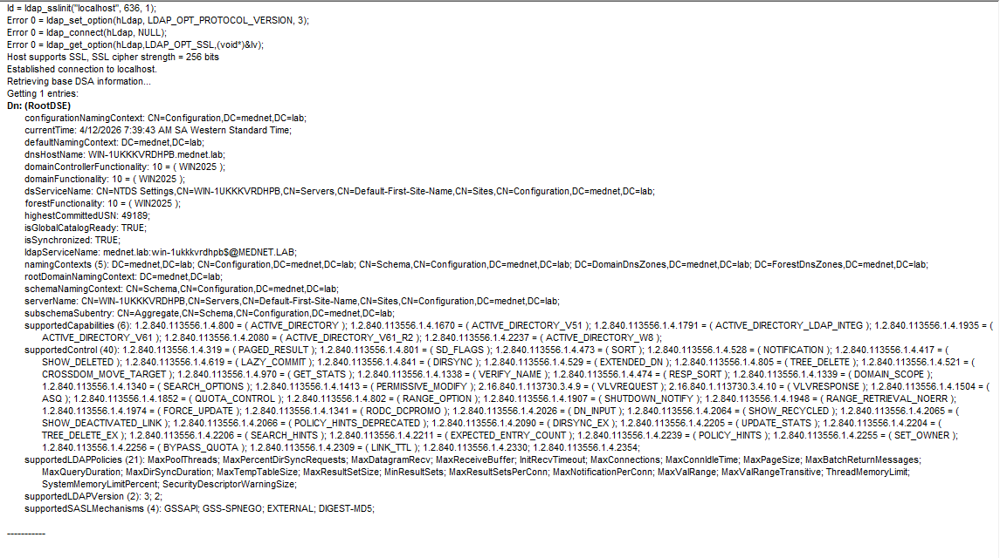
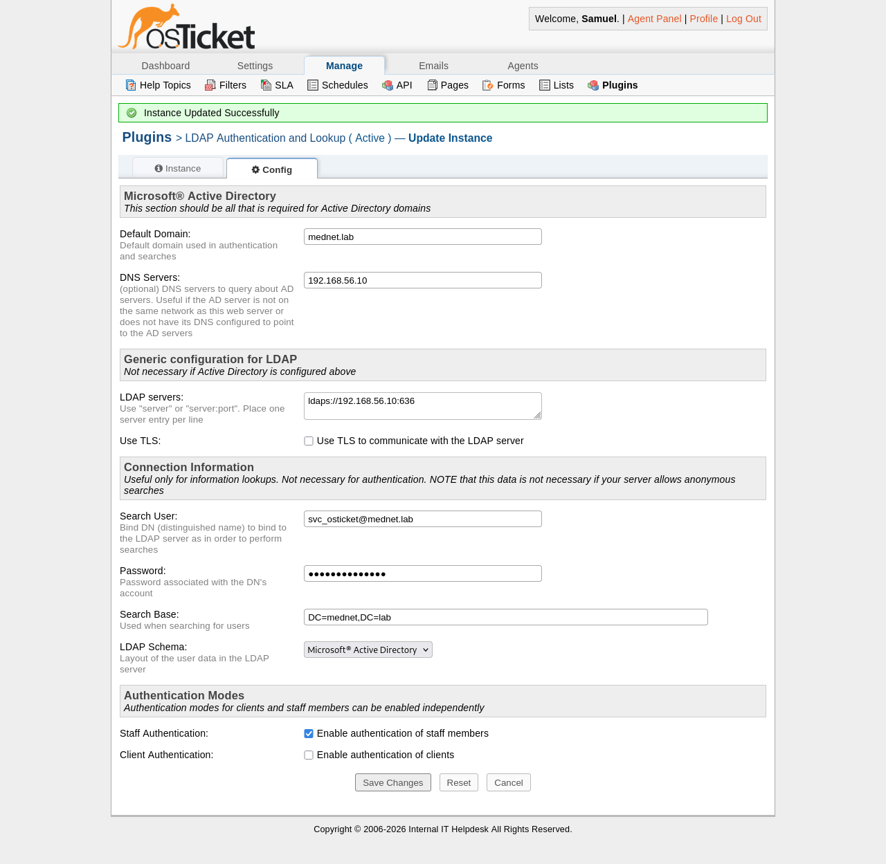
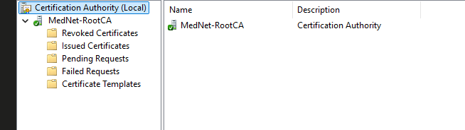

# 03 — PKI and LDAPS
 
## Overview
 
This document covers the internal Public Key Infrastructure (PKI) setup for the MedNet Enterprise Lab, including the deployment of an enterprise Certificate Authority (CA), LDAPS configuration on the domain controller, certificate trust deployment on Linux hosts, and the integration of LDAPS with the osTicket ITSM platform.
 
---
 
## Architecture Summary
 
| Component | Details |
|---|---|
| CA Name | `MedNet-RootCA` |
| CA Type | Enterprise Root CA |
| CA Host | `dc01.mednet.lab` |
| Distinguished Name | `CN=MedNet-RootCA,DC=mednet,DC=lab` |
| LDAPS Port | 636 |
| Certificate Format | PEM |
| osTicket Integration | LDAPS via `svc_osticket` service account |
 
---
 
## Part 1 — Active Directory Certificate Services (AD CS)
 
### Role Installation
 
Active Directory Certificate Services was installed via Server Manager using the **Add Roles and Features** wizard. The **Certification Authority** role service was selected during installation.
 
### CA Configuration
 
After installation, the CA was configured through the AD CS post-deployment wizard with the following settings:
 
| Setting | Value |
|---|---|
| Setup Type | Enterprise CA |
| CA Type | Root CA |
| Private Key | New private key created |
| CA Common Name | `MedNet-RootCA` |
| Validity Period | 5 years |
 
The CA name was explicitly set to `MedNet-RootCA` rather than accepting the auto-generated default (`mednet-WIN-1UKKVRDHPB-CA`) to produce a clean, environment-appropriate name that appears consistently across all issued certificates.
 
Upon successful configuration, Windows automatically issued a domain controller certificate to `WIN-1UKKVRDHPB.mednet.lab`, enabling LDAPS on port 636.
 

 
---
 
## Part 2 — LDAPS Configuration
 
### Verification
 
LDAPS was verified using `ldp.exe` on the domain controller. A successful SSL connection to `localhost` on port 636 confirmed the DC certificate was correctly issued and bound to the LDAP service.
 
Key indicators from the `ldp.exe` output:
- `Host supports SSL, SSL cipher strength = 256 bits`
- `Established connection to localhost`
- `rootDomainNamingContext: DC=mednet,DC=lab`
 

 
### Firewall
 
The Windows Defender Firewall rule `ADDS-LDAPSEC-TCP-In` (TCP 636) was confirmed enabled and set to allow inbound connections on all profiles, permitting external LDAP clients to connect over SSL.
 
---
 
## Part 3 — Certificate Trust Deployment (Linux)
 
To allow the Debian-based osTicket VM to trust the self-signed `MedNet-RootCA` certificate, the CA certificate was exported from the DC and imported into the Linux OS trust store.
 
### Certificate Transfer
 
The CA certificate was exported from Windows in PEM format and transferred to the Debian VM via SMB using a temporary share:
 
```powershell
# On Windows DC — create temporary share
New-SmbShare -Name "CertShare" -Path "C:\Users\Administrator" -FullAccess "Everyone"
```
 
```bash
# On Debian osTicket VM — mount share and copy cert
mkdir /mnt/certshare
mount -t cifs //192.168.56.10/CertShare /mnt/certshare -o username=Administrator
cp /mnt/certshare/mednet-rootca.cer ~/mednet-rootca.cer
```
 
### Trust Store Installation
 
```bash
# Copy cert to trusted CA store
sudo cp ~/mednet-rootca.cer /usr/local/share/ca-certificates/mednet-rootca.crt
 
# Update OS trust store
sudo update-ca-certificates
 
# Restart Apache to apply
sudo systemctl restart apache2
```
 
Output confirmed: `1 added, 0 removed; done`
 
### PHP LDAP Client Configuration
 
To ensure PHP's LDAP library respected the updated trust store, the following was added to `/etc/ldap/ldap.conf`:
 
```
TLS_REQCERT never
```
 
> **Note:** `TLS_REQCERT never` disables strict certificate chain validation on the PHP LDAP client. In a production environment this would be replaced with `TLS_REQCERT demand` combined with proper certificate chain validation. For this lab environment it resolves the self-signed CA trust issue while still enforcing encrypted transport over port 636.
 
---
 
## Part 4 — osTicket LDAPS Integration
 
### Service Account
 
A dedicated service account was created in the `Service Accounts` OU for osTicket's LDAP bind operations:
 
```powershell
New-ADUser -Name "svc_osticket" `
  -UserPrincipalName "svc_osticket@mednet.lab" `
  -SamAccountName "svc_osticket" `
  -AccountPassword (ConvertTo-SecureString "PASSWORD" -AsPlainText -Force) `
  -Enabled $true `
  -Path "OU=Service Accounts,DC=mednet,DC=lab"
```
 
Using a dedicated service account rather than a standard user account ensures LDAP bind operations are not disrupted by password changes or account modifications affecting regular staff accounts.
 
### Plugin Configuration
 
The osTicket LDAP Authentication and Lookup plugin was configured with the following settings:
 
| Setting | Value |
|---|---|
| Default Domain | `mednet.lab` |
| DNS Servers | `192.168.56.10` |
| LDAP Server | `ldaps://192.168.56.10:636` |
| Search User | `svc_osticket@mednet.lab` |
| Search Base | `DC=mednet,DC=lab` |
| LDAP Schema | Microsoft Active Directory |
| Staff Authentication | Enabled |
 
The DC is referenced by IP address rather than hostname to bypass DNS resolution dependency on the osTicket VM, which uses the DC's IP directly for DNS queries.
 

 
---
 
## Known Limitations
 
| Limitation | Production Recommendation |
|---|---|
| `TLS_REQCERT never` set on Debian LDAP client | Replace with `TLS_REQCERT demand` and properly chained CA cert |
| CA certificate manually transferred via SMB | Deploy via GPO using Computer Configuration → Windows Settings → Security Settings → Public Key Policies → Trusted Root Certification Authorities |
| DC referenced by IP in osTicket | Configure DNS on osTicket VM to use DC as resolver, then reference by FQDN |
 
---
 
## Related Documents
 
| Document | Description |
|---|---|
| [01-domain-design.md](01-domain-design.md) | OU structure, naming conventions, hospital org model |
| [02-gpo-configuration.md](02-gpo-configuration.md) | GPO design, settings, and enforcement details |
| [04-security-hardening.md](04-security-hardening.md) | Account policies, audit configuration, event forwarding |
