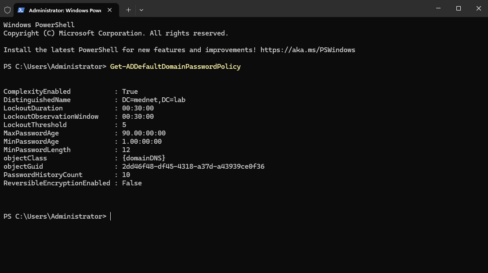
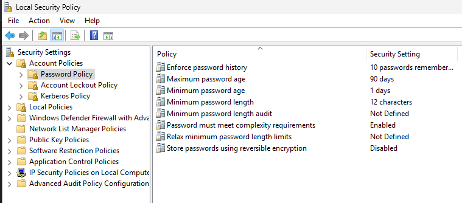
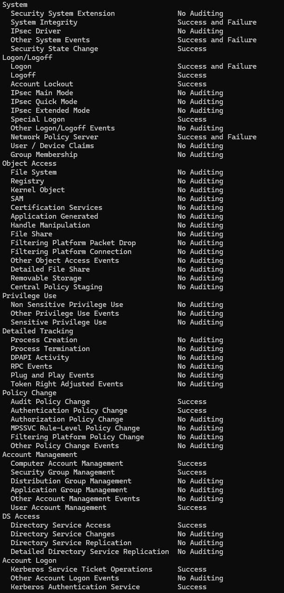
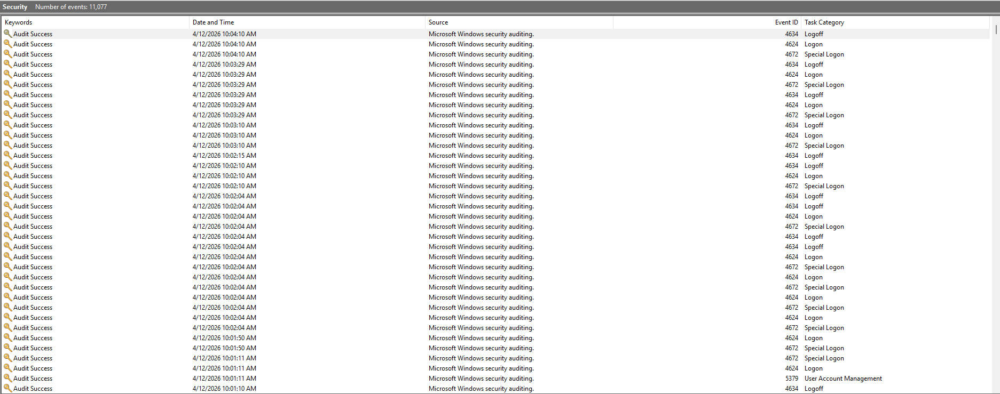

# Security Hardening

## Overview

This document covers the security hardening configuration for the MedNet Enterprise Lab, including domain-wide account policies, audit policy configuration, and event log monitoring. These controls simulate baseline security standards expected in a healthcare IT environment, where regulatory compliance (HIPAA) requires demonstrable access controls, audit trails, and incident detection capability.

---

## Part 1 — Account Policies

Account policies are enforced domain-wide via the Default Domain Policy GPO, ensuring all user accounts in `mednet.lab` are subject to the same password and lockout standards regardless of department.

### Password Policy

| Setting | Configured Value | Rationale |
|---|---|---|
| Minimum password length | 12 characters | Exceeds NIST SP 800-63B baseline recommendation |
| Password complexity | Enabled | Requires mix of character types |
| Maximum password age | 90 days | Limits exposure window of compromised credentials |
| Minimum password age | 1 day | Prevents immediate password reuse cycling |
| Password history | 10 passwords remembered | Prevents reuse of recent passwords |
| Reversible encryption | Disabled | Ensures passwords are not stored in recoverable form |

### Account Lockout Policy

| Setting | Configured Value | Rationale |
|---|---|---|
| Lockout threshold | 5 invalid attempts | Mitigates brute force and credential stuffing attacks |
| Lockout duration | 30 minutes | Automatic unlock without admin intervention |
| Observation window | 30 minutes | Reset counter window aligns with lockout duration |

### Verification

Policy enforcement was verified via PowerShell and Local Security Policy, confirming settings are actively applied to the domain.

| | |
|---|---|
|  |  |

---

## Part 2 — Audit Policy

Audit policy is configured via the `IT-Department-Policy` GPO linked to `Workstations/Computers`, ensuring logon, account-management, and policy-change activity is logged to the Windows Security event log across all domain-joined endpoints. The domain controller is audited separately by the built-in `Default Domain Controllers Policy`, which is the standard mechanism for DC-level audit. Because audit settings are Computer Configuration, they are linked to the OU that holds the machine objects rather than a user OU, so they apply to the endpoints as intended.

### Configured Audit Categories

| Category | Setting | Event IDs Generated |
|---|---|---|
| Logon / Logoff — Logon | Success and Failure | 4624, 4625 |
| Logon / Logoff — Logoff | Success | 4634 |
| Logon / Logoff — Account Lockout | Success | 4740 |
| Logon / Logoff — Special Logon | Success | 4672 |
| Policy Change — Audit Policy Change | Success | 4719 |
| Policy Change — Authentication Policy Change | Success | 4706 |
| Account Management — User Account Management | Success | 4720, 4722, 4723, 4724, 4725, 4726 |
| Account Management — Computer Account Management | Success | 4741, 4742, 4743 |
| Account Management — Security Group Management | Success | 4727, 4728, 4729 |
| DS Access — Directory Service Access | Success | 4662 |
| Account Logon — Kerberos Authentication | Success | 4768, 4769 |

### Verification

Audit policy was verified using `auditpol /get /category:*` confirming active auditing across logon, policy change, and account management categories.

---

## Part 3 — Security Event Log

### Event Log Configuration

Event log retention sizes are configured via the `Workstation-Baseline-Policy` GPO (linked to `Workstations/Computers`) to prevent log rollover on active systems:

| Log | Configured Size |
|---|---|
| Security | 81920 KB |
| Application | 32768 KB |
| System | 32768 KB |

The Security log is sized larger to accommodate the higher volume of audit events generated by logon activity, policy changes, and account management operations.

### Active Security Events

The Security event log is actively generating audit entries. At the time of documentation, **11,077 security events** were recorded, including:

| Event ID | Category | Description |
|---|---|---|
| 4624 | Logon | Successful account logon |
| 4634 | Logoff | Account logoff |
| 4672 | Special Logon | Admin-equivalent privileges assigned at logon |
| 5379 | Account Management | Credential Manager credentials read |

The volume and variety of events confirm that audit policy is actively enforcing and logging security-relevant activity across the domain.

---

## Part 4 — Hardening Summary

The table below summarizes all security controls implemented across the lab environment, their scope, and the mechanism used to enforce them.

| Control | Scope | Enforcement Mechanism |
|---|---|---|
| Password complexity and length | Domain-wide | Default Domain Policy GPO |
| Account lockout | Domain-wide | Default Domain Policy GPO |
| Screen lock — 5 min | Clinical staff | Clinical-Workstation-Policy GPO |
| Screen lock — 10 min | Administrative staff | Administrative-User-Policy GPO |
| Control Panel restricted | Clinical users | Clinical-Workstation-Policy GPO |
| CMD/PowerShell restricted | Administrative users | Administrative-User-Policy GPO |
| Removable storage denied | All endpoints | Workstation-Baseline-Policy GPO |
| Autorun/Autoplay disabled | All endpoints | Workstation-Baseline-Policy GPO |
| Windows Firewall enforced | All endpoints | Workstation-Baseline-Policy GPO |
| Event log size enforcement | All endpoints | Workstation-Baseline-Policy GPO |
| Audit — logon/logoff | All endpoints | IT-Department-Policy GPO |
| Audit — privilege use | All endpoints | IT-Department-Policy GPO |
| Audit — policy change | All endpoints | IT-Department-Policy GPO |
| Audit — account management | All endpoints | IT-Department-Policy GPO |
| Audit — domain controller | Domain controller | Default Domain Controllers Policy |
| LDAPS encryption | Domain controller | AD CS / MedNet-RootCA |
| Internal PKI | Domain-wide | MedNet-RootCA Enterprise CA |

---

## Part 5 — SIEM Integration

Security events from the Windows Security log on the domain controller and all domain-joined endpoints are forwarded to the Wazuh SIEM for correlation, alerting, and long-term retention. This adds a SOC layer on top of the native Windows audit infrastructure, turning raw audit events into actionable detection. The DC is treated as a high-priority log source, consistent with production SOC practice. SIEM configuration is documented in the [MedNet-SIEM](../05-MedNet-SIEM/README.md) module.

---

## Future Enhancements

The following hardening measures are planned for later phases of the lab:

- **Fine-Grained Password Policies (PSOs)** — Stricter password policies for the `Admin Accounts` OU (e.g., 16-character minimum, 60-day rotation) using Active Directory Fine-Grained Password Policies.
- **Endpoint Detection & Response** — Windows Defender alerts from the endpoints ingested by Wazuh to extend coverage beyond Windows audit events into endpoint threat detection.

---

## Related Documents

| Document | Description |
|---|---|
| [01-domain-design.md](01-domain-design.md) | OU structure, naming conventions, hospital org model |
| [02-gpo-configuration.md](02-gpo-configuration.md) | GPO design, settings, and enforcement details |
| [03-pki-and-ldaps.md](03-pki-and-ldaps.md) | Internal CA setup, certificate deployment, LDAPS configuration |
