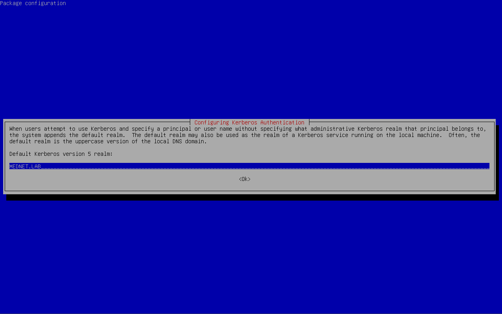
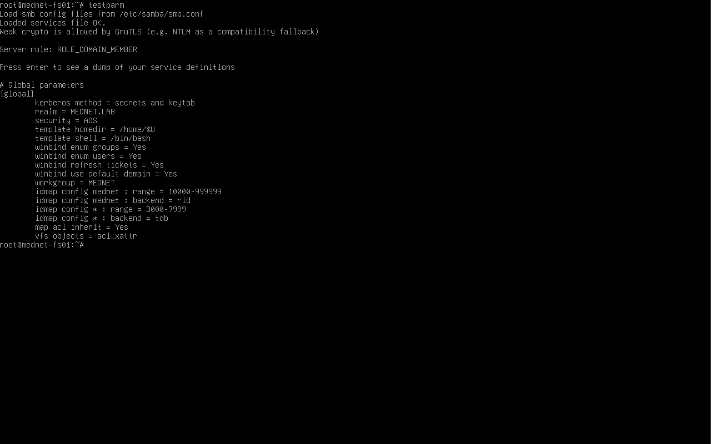
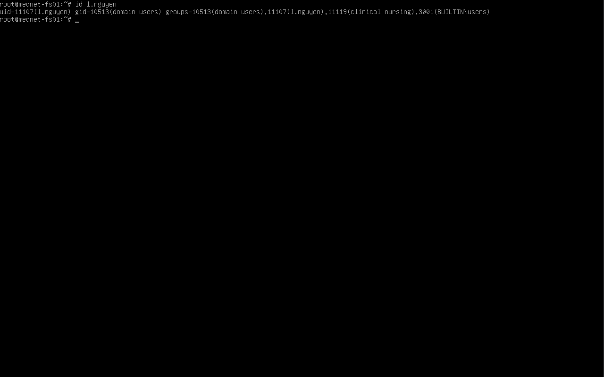

# AD Integration

## Overview

This document covers how `mednet-fs01` was joined to the `mednet.lab` Active Directory domain and configured to authenticate users and resolve groups against AD. As a domain member, the file server uses the same Kerberos infrastructure as the domain-joined Windows machines — staff access shares with their existing AD identities, and no separate local accounts are maintained on the server.

This AD integration is the foundation the rest of the module is built on: the hospital share structure ([02-share-structure.md](02-share-structure.md)) and the AD group-based permissions ([03-permissions-and-acls.md](03-permissions-and-acls.md)) both depend on the server being able to resolve AD users and their group memberships. The server participates as a standard domain member, **not** a domain controller.

---

## Authentication Architecture

The file server uses two complementary AD protocols, each handling a distinct job:

| Protocol | Role |
|---|---|
| **Kerberos** | Interactive authentication — users access shares using AD tickets; on domain-joined clients no password is re-entered |
| **LDAP** | Directory lookups — resolving AD user and group information so share permissions can be enforced |

This is the same Kerberos infrastructure the domain-joined Windows endpoints use. Authentication happens on the file server (which is domain-joined), so a client does not itself need to be domain-joined to be authenticated against AD — it only changes whether the experience is single-sign-on or credential-prompted.

---

## Prerequisites

The following were confirmed before attempting the domain join:

- Domain controller `dc01.mednet.lab` running and reachable at `192.168.56.10`
- Ports `389` (LDAP) and `445` (SMB) open on the DC
- The file server's DNS resolver pointing at the DC
- System time synchronized (Kerberos requires clocks within 5 minutes)
- AD security groups already created in `OU=Security Groups,DC=mednet,DC=lab` (see [MedNet-ActiveDirectory/01-domain-design.md](../../01-MedNet-ActiveDirectory/docs/01-domain-design.md))

---

## DNS Configuration

The file server's resolver was pointed at the domain controller so that AD service records (`_ldap`, `_kerberos`) resolve and the domain can be discovered:

```
# /etc/resolv.conf
domain mednet.lab
search mednet.lab
nameserver 192.168.56.10
```

---

## Package Installation

The packages required to join and authenticate against AD were installed:

```bash
apt install realmd sssd sssd-tools adcli krb5-user packagekit samba-common-bin -y
```

| Package | Purpose |
|---|---|
| `realmd` | Domain discovery and join orchestration |
| `sssd` / `sssd-tools` | System Security Services Daemon and utilities — AD authentication |
| `adcli` | Active Directory command-line interface |
| `krb5-user` | Kerberos client utilities (`kinit`, `klist`) |
| `packagekit` | Dependency required by `realmd` |
| `samba-common-bin` | Samba tools including `net ads` |

During installation the Kerberos configuration prompt was answered as follows:

| Prompt | Value |
|---|---|
| Default Kerberos realm | `MEDNET.LAB` |
| Kerberos server | `192.168.56.10` |
| Administrative server | `192.168.56.10` |

> **Note:** The Kerberos realm is entered in uppercase (`MEDNET.LAB`). This is a Kerberos convention, not a typo — the realm name is case-sensitive and AD presents it uppercase.



---

## smb.conf — Domain Member Configuration

Before joining, the `[global]` section of `/etc/samba/smb.conf` was configured to operate as an AD domain member. The directives below govern AD integration and identity mapping; the SMB transport-hardening directives (signing, minimum protocol, NTLM) are added in [04-security-hardening.md](04-security-hardening.md). This is the live configuration as reported by `testparm`:

```ini
[global]
   kerberos method = secrets and keytab
   realm = MEDNET.LAB
   security = ADS
   workgroup = MEDNET

   template homedir = /home/%U
   template shell = /bin/bash

   winbind enum groups = Yes
   winbind enum users = Yes
   winbind refresh tickets = Yes
   winbind use default domain = Yes

   idmap config mednet : backend = rid
   idmap config mednet : range = 10000-999999
   idmap config * : backend = tdb
   idmap config * : range = 3000-7999

   map acl inherit = Yes
   vfs objects = acl_xattr
```

> **Note — `security = ADS`:** Tells Samba to operate as a domain member that authenticates against Active Directory rather than maintaining its own local user database. This setting was also the fix for an early join failure (see below).

> **Note — `idmap config`:** The `mednet` domain uses the `rid` backend, which derives each user's UID/GID algorithmically from the RID portion of their AD SID — no POSIX attributes need to be stored in AD, and the mapping is identical on any server using the same config. (For example, `l.nguyen` resolves to UID `11107`: the range base `10000` plus her account's RID.) The `*` (default) domain uses the `tdb` backend with a lower range for non-domain identities such as `BUILTIN\users`. A single-character typo in the domain name on these lines produces a persistent, misleading error, so the `idmap config <domain>` name must match the `workgroup`.

> **Note — winbind & templates:** `winbind use default domain = Yes` is why AD accounts resolve by bare username (`l.nguyen`) with no `MEDNET\` prefix. `template homedir` and `template shell` set the home path and shell winbind reports for AD users. `map acl inherit` and `vfs objects = acl_xattr` enable storage of fine-grained POSIX ACLs, which the permissions model in [03-permissions-and-acls.md](03-permissions-and-acls.md) depends on.

---

## Domain Join

The join was not straightforward, and the path to success is worth preserving because the failures are common and the error messages are misleading.

**Attempt 1 — `realm join`** failed with a Kerberos encryption negotiation error (`Couldn't set password for computer account: Message stream modified`). This initially looked like a time-sync problem but was not — it was the encryption types being negotiated for the computer account password.

**Attempt 2 — `net ads join`** failed with `This operation is only allowed for the PDC`. This was resolved by correcting `smb.conf` to use `security = ADS` (above).

**Attempt 3 — `net ads join`** then failed with `No logon servers available`, despite ports `135`, `389`, and `445` all being open and DC services confirmed running.

**Working solution** — pre-authenticate as the domain administrator to obtain a Kerberos ticket, then join using that ticket:

```bash
kinit Administrator@MEDNET.LAB
net ads join -k
```

> **Why this worked:** `kinit` obtains a Kerberos TGT for the administrator account up front, and `net ads join -k` uses that existing ticket rather than negotiating credentials during the join. This sidesteps the encryption-negotiation failure that broke the other two methods. This same `kinit` + `net ads join -k` approach is the reliable fallback used elsewhere in the lab for joining Linux hosts to the Server 2025 domain.


---

## Validation

After joining, the configuration and AD integration were verified.

**Configuration check** — `testparm` confirmed a valid config and domain-member role:

```bash
testparm
```

```
Loaded services file OK.
Server role: ROLE_DOMAIN_MEMBER
```

**Service restart:**

```bash
systemctl restart smbd nmbd
systemctl status smbd
```

**Join and identity resolution** — these confirm the server can not only see the domain but resolve AD users *and their group memberships*, which is what share permissions depend on:

```bash
net ads testjoin                  # "Join is OK"
wbinfo -u | head                  # AD users visible to winbind
wbinfo -g | grep -i clinical      # the clinical security groups
getent passwd l.nguyen            # NSS resolves the AD user
getent group clinical-nursing     # NSS resolves the AD group
id l.nguyen                       # user's group memberships, incl. clinical-nursing
```

> **The critical check is `id l.nguyen`.** Its output must list the user's AD security group — here `clinical-nursing` (winbind presents the names lowercased). If the group does not appear, the corresponding share will deny that user even when the share itself is configured correctly, making this the first thing to check when troubleshooting access later.

| | |
|---|---|
|  |  |

---

## Related Documents

| Document | Description |
|---|---|
| [02-share-structure.md](02-share-structure.md) | Hospital share layout, on-disk structure, and `smb.conf` share definitions |
| [03-permissions-and-acls.md](03-permissions-and-acls.md) | AD group-to-share mapping, POSIX ACLs, and access control |
| [04-security-hardening.md](04-security-hardening.md) | SMB signing, protocol hardening, firewall, and SSH hardening |
| [MedNet-ActiveDirectory/01-domain-design.md](../../01-MedNet-ActiveDirectory/docs/01-domain-design.md) | AD OU structure, security groups, and user accounts |
