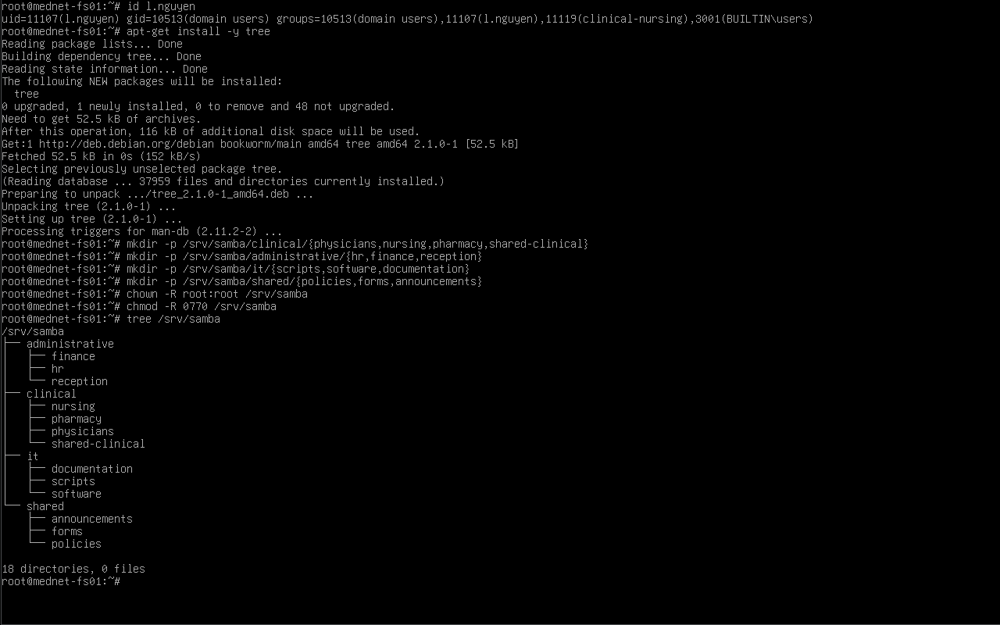
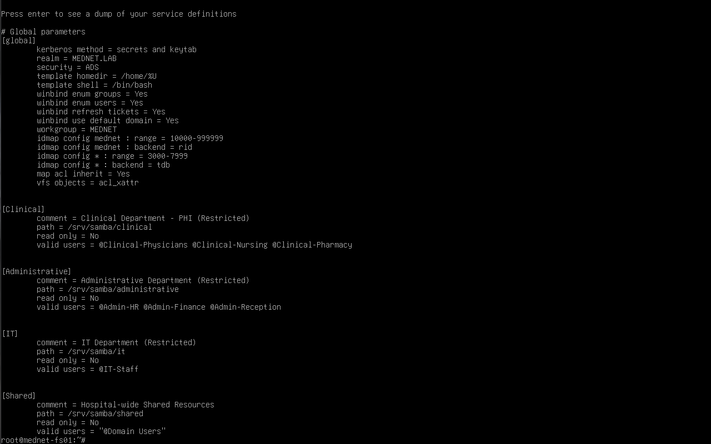
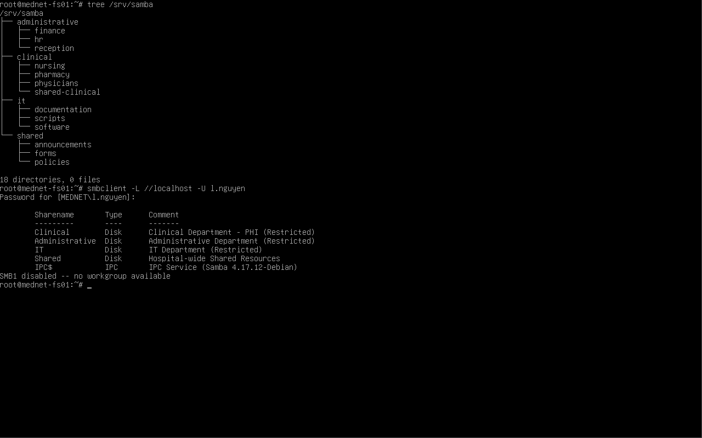

# 02 — Share Structure

## Overview

This document covers the SMB share layout on `mednet-fs01`: the on-disk directory structure, the `smb.conf` share definitions, and how each share is gated by Active Directory group membership.

The file server is organized around **four department-category shares** rather than one share per individual department. Each share admits the AD security groups belonging to that category, and the individual departments live as subdirectories beneath it. This mirrors how a hospital file server is realistically structured — staff connect to their department's area, and access is compartmentalized by function in line with the HIPAA *minimum necessary* principle.

| Share | Scope | AD Groups Permitted (`valid users`) | On-disk Path |
|---|---|---|---|
| `Clinical` | Clinical departments — PHI (Restricted) | `Clinical-Physicians`, `Clinical-Nursing`, `Clinical-Pharmacy` | `/srv/samba/clinical` |
| `Administrative` | Administrative departments (Restricted) | `Admin-HR`, `Admin-Finance`, `Admin-Reception` | `/srv/samba/administrative` |
| `IT` | IT department (Restricted) | `IT-Staff` | `/srv/samba/it` |
| `Shared` | Hospital-wide shared resources | `Domain Users` (all staff) | `/srv/samba/shared` |

This document covers **who can connect to each share** (the share-level gate). The file-level read/write control *inside* each share — the POSIX ACL layer — is covered in [03-permissions-and-acls.md](03-permissions-and-acls.md).

---

## On-disk Directory Structure

The share root is `/srv/samba`, with each category share holding its department subdirectories:

```
/srv/samba
├── administrative
│   ├── finance
│   ├── hr
│   └── reception
├── clinical
│   ├── nursing
│   ├── pharmacy
│   ├── physicians
│   └── shared-clinical
├── it
│   ├── documentation
│   ├── scripts
│   └── software
└── shared
    ├── announcements
    ├── forms
    └── policies
```

The structure was created and given a restrictive base ownership and mode:

```bash
mkdir -p /srv/samba/clinical/{physicians,nursing,pharmacy,shared-clinical}
mkdir -p /srv/samba/administrative/{hr,finance,reception}
mkdir -p /srv/samba/it/{scripts,software,documentation}
mkdir -p /srv/samba/shared/{policies,forms,announcements}

chown -R root:root /srv/samba
chmod -R 0770 /srv/samba
```

> **Note — base ownership and mode:** Everything is owned `root:root` with mode `0770`. This is a deliberate default-deny posture: the `0770` mode grants nothing to "other," so no account outside `root` has access by default. Access for the actual department groups is then granted explicitly through POSIX ACLs ([03-permissions-and-acls.md](03-permissions-and-acls.md)), layered on top of this locked-down base — the file-level equivalent of starting from "deny all" and granting only what each role needs.



---

## Share Definitions

The four shares are defined in the `[shares]` portion of `/etc/samba/smb.conf`. Each definition is intentionally minimal — the `valid users` line is the security-relevant one:

```ini
[Clinical]
   comment = Clinical Department - PHI (Restricted)
   path = /srv/samba/clinical
   browseable = yes
   read only = no
   valid users = @"Clinical-Physicians" @"Clinical-Nursing" @"Clinical-Pharmacy"

[Administrative]
   comment = Administrative Department (Restricted)
   path = /srv/samba/administrative
   browseable = yes
   read only = no
   valid users = @"Admin-HR" @"Admin-Finance" @"Admin-Reception"

[IT]
   comment = IT Department (Restricted)
   path = /srv/samba/it
   browseable = yes
   read only = no
   valid users = @"IT-Staff"

[Shared]
   comment = Hospital-wide Shared Resources
   path = /srv/samba/shared
   browseable = yes
   read only = no
   valid users = @"Domain Users"
```

### How the gate works

| Directive | Effect |
|---|---|
| `valid users = @"Group"` | The `@` denotes an AD group. Only members of the listed groups can connect to the share at all — anyone else is refused at tree-connect with `NT_STATUS_ACCESS_DENIED`. This is the share-level gatekeeper. |
| `read only = no` | Permitted users may write, subject to the underlying filesystem ACLs. |
| `browseable = yes` | The share appears in the server's share list. Note that visibility is not access: a user can see a share exists and still be denied connection by `valid users`. |

> **Note — two enforcement layers.** Access control here is intentionally layered, mirroring a Windows file server. The `valid users` directive is the **share-level** gate (who may connect — this is what produces a clean denial). The **filesystem POSIX ACLs** are the second layer (what a connected user may read or write), documented in [03-permissions-and-acls.md](03-permissions-and-acls.md). A user must clear both to read or write a file.

---

## Validation

### Configuration

The configuration was validated with `testparm`, which parses `smb.conf` and prints the effective settings. The output confirms a clean parse and shows all four share definitions with their `valid users` gates intact:

```bash
testparm
```



### Share visibility

The shares were confirmed live and listable by connecting as an AD user with `smbclient`. Authenticating as `l.nguyen` (an AD account) returns the four shares plus the default `IPC$`, confirming the server is serving them and authenticating against AD:

```bash
smbclient -L //localhost -U l.nguyen
```

The output also confirms `SMB1 disabled` — legacy SMB1 is not offered (covered further in [04-security-hardening.md](04-security-hardening.md)).



---

## Design Rationale

**Why four category shares rather than one per department.** A flat layout of seven or eight individual shares (one per department group) would work, but the category model is cleaner and scales better: a single `Clinical` mount point serves all clinical staff, with the per-department folders organizing content inside it. It mirrors how clinical, administrative, and IT areas are actually segmented in a hospital, and it keeps the number of mapped drives manageable for end users.

**Compartmentalization.** The hard security boundary is at the category level — clinical staff cannot connect to the `Administrative` or `IT` shares, and vice versa, because the `valid users` gate refuses them outright. This is the primary HIPAA *minimum necessary* control: a member of HR has no path to clinical PHI. Finer-grained separation *within* a category (for example, restricting the `pharmacy` subfolder to pharmacy staff only) is a function of the POSIX ACLs in the next document, where the read/write boundaries inside each share are defined.

---

## Related Documents

| Document | Description |
|---|---|
| [01-ad-integration.md](01-ad-integration.md) | Domain join, Kerberos authentication, and AD identity resolution |
| [03-permissions-and-acls.md](03-permissions-and-acls.md) | POSIX ACLs, group-based read/write control, and the allow/deny access demonstration |
| [04-security-hardening.md](04-security-hardening.md) | SMB signing, protocol hardening, firewall, and SSH hardening |
| [MedNet-ActiveDirectory/01-domain-design.md](../../01-MedNet-ActiveDirectory/docs/01-domain-design.md) | AD security groups referenced by `valid users` |
