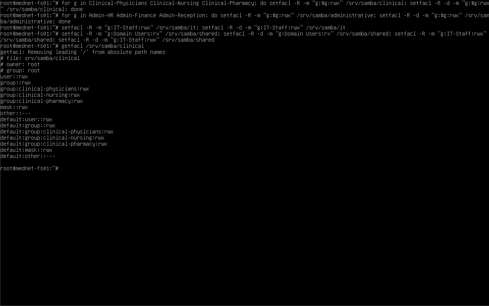
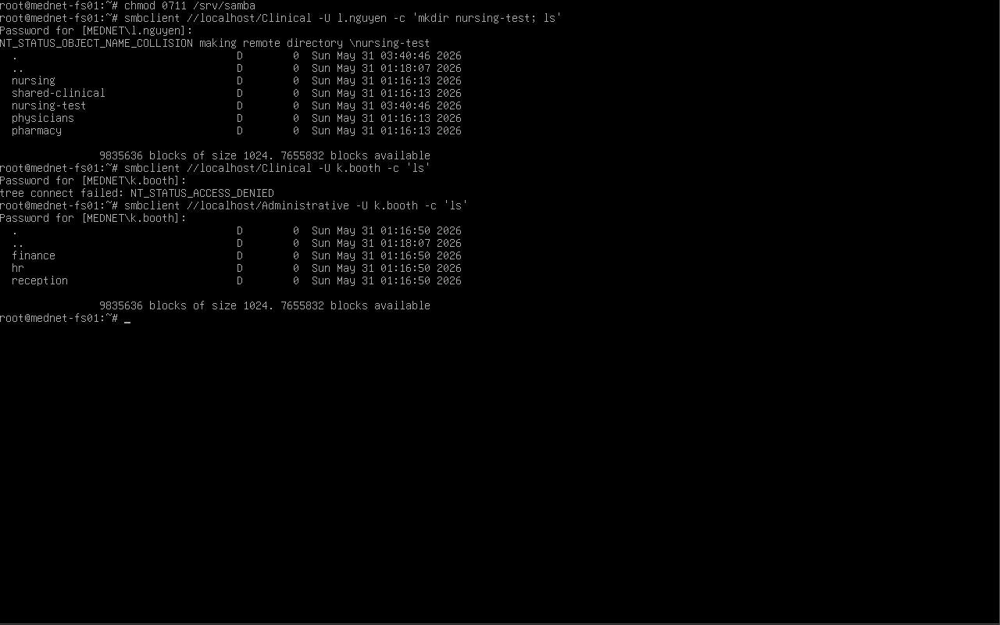
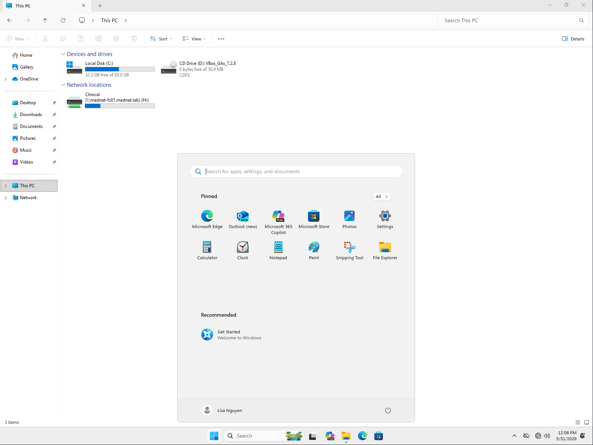
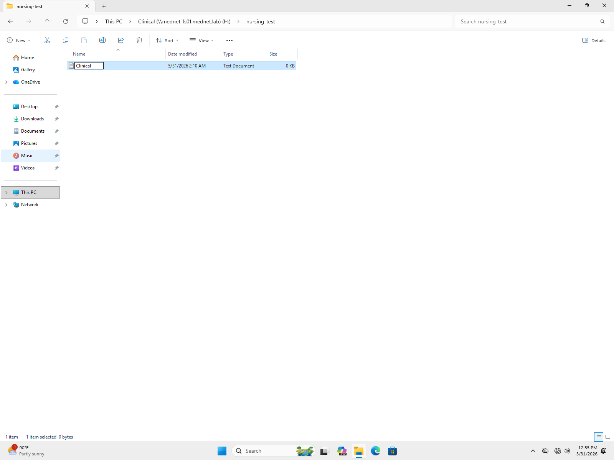
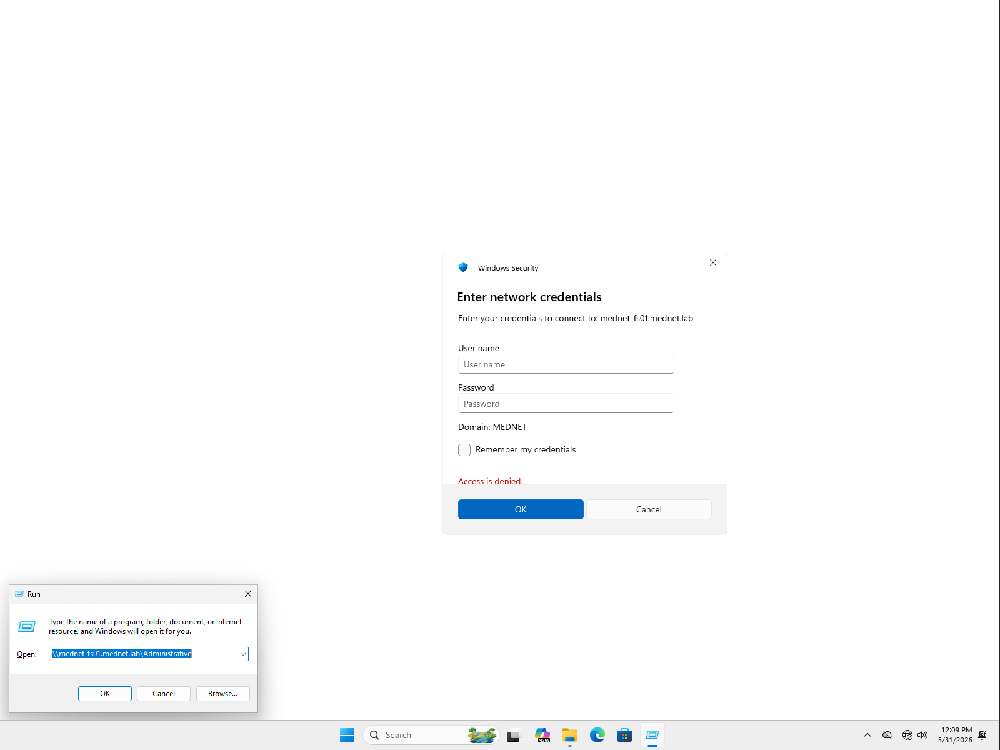
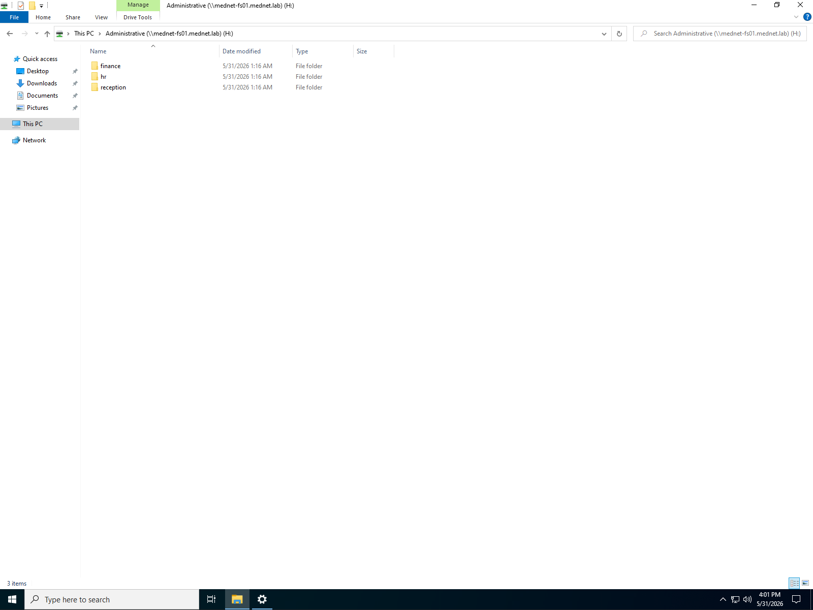
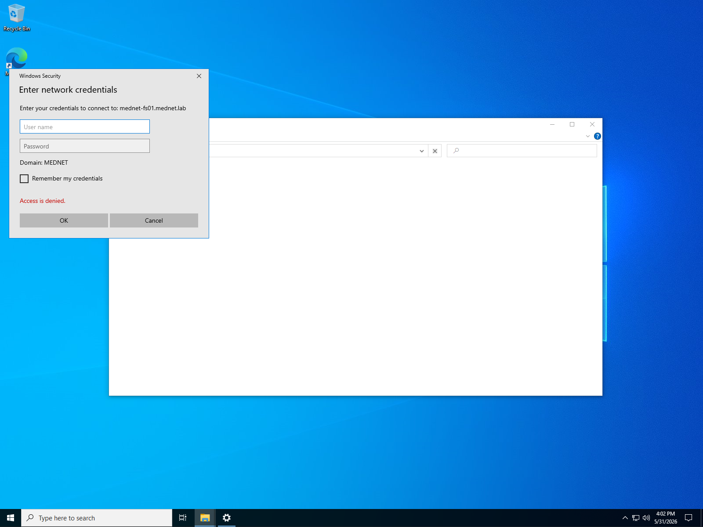
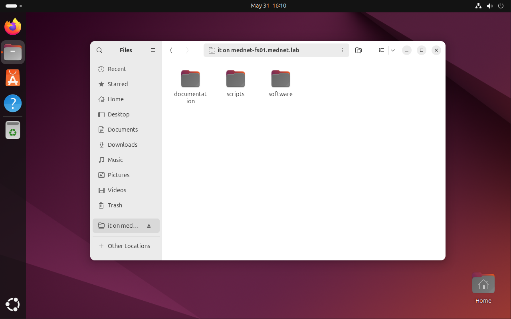
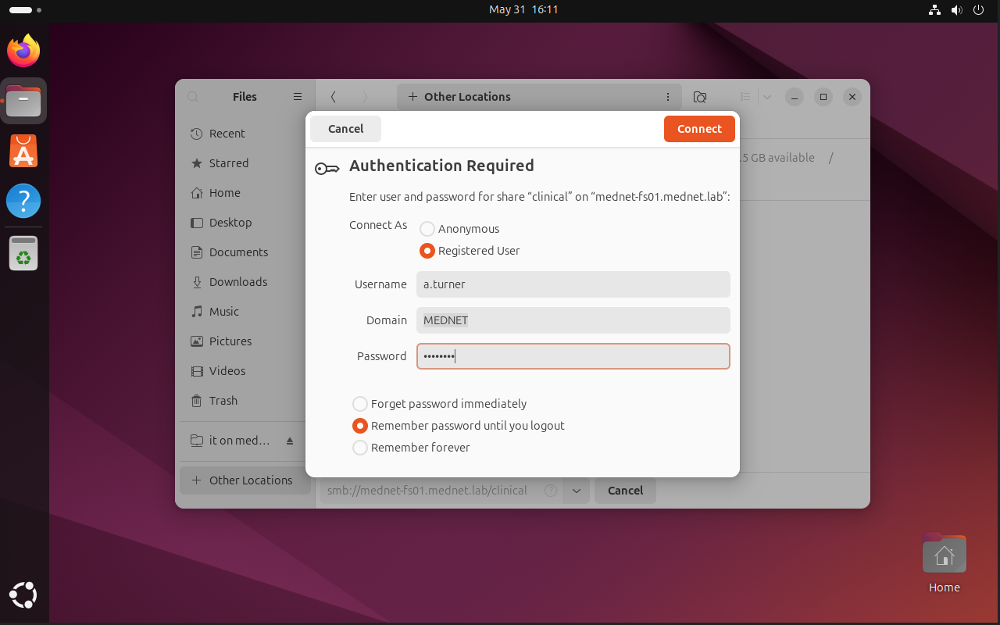

# 03 — Permissions and ACLs

## Overview

This document covers the file-level access control on `mednet-fs01` and demonstrates it end to end. Where [02-share-structure.md](02-share-structure.md) established *who can connect* to each share (the share-level `valid users` gate), this document covers *what a connected user can read and write* — the POSIX ACL layer — and then proves the complete model with real user logins across three operating systems.

The result is the core of the file server: **group-based access control sourced entirely from Active Directory, enforced consistently across Windows 11, Windows 10, and Linux against a single identity source.** A clinical user reaches clinical data and is refused administrative data; an administrative user is the mirror image; an IT user reaches IT resources and is refused clinical data. This is the HIPAA *minimum necessary* principle made concrete.

### Two enforcement layers

| Layer | Mechanism | Enforced in |
|---|---|---|
| Share-level (who may connect) | `valid users = @"AD-Group"` in `smb.conf` | [02-share-structure.md](02-share-structure.md) |
| File-level (what may be read/written) | POSIX ACLs on the filesystem | This document |

A user must clear **both** layers to read or write a file. The share gate produces the clean "access denied" at connect time; the ACLs govern read/write once connected. Together they mirror a Windows file server's share permissions plus NTFS permissions.

---

## Part A — Filesystem ACLs

### The acl package

POSIX ACL tooling (`setfacl` / `getfacl`) is provided by the `acl` package, which is not installed by default on a minimal Debian server:

```bash
apt-get install -y acl
```

ext4 (the file server's filesystem) supports ACLs out of the box on Debian, so no remount or `tune2fs` change was required once the tooling was installed.

### Applying the ACLs

Each category tree is granted `rwx` for the AD groups that belong to it. Two entries are set per group: a standard entry (governs existing files) and a **default** entry (`-d`, governs files created later). The default entry is the Linux equivalent of NTFS permission inheritance — new files and folders automatically receive the parent's access rules.

```bash
# Clinical — all three clinical groups, full access across the clinical tree
for g in Clinical-Physicians Clinical-Nursing Clinical-Pharmacy; do
  setfacl -R -m  "g:$g:rwx" /srv/samba/clinical
  setfacl -R -d -m "g:$g:rwx" /srv/samba/clinical
done

# Administrative — the three administrative groups
for g in Admin-HR Admin-Finance Admin-Reception; do
  setfacl -R -m  "g:$g:rwx" /srv/samba/administrative
  setfacl -R -d -m "g:$g:rwx" /srv/samba/administrative
done

# IT
setfacl -R -m  "g:IT-Staff:rwx" /srv/samba/it
setfacl -R -d -m "g:IT-Staff:rwx" /srv/samba/it

# Shared — all staff read, IT manages
setfacl -R -m  "g:Domain Users:rx"  /srv/samba/shared
setfacl -R -d -m "g:Domain Users:rx"  /srv/samba/shared
setfacl -R -m  "g:IT-Staff:rwx"     /srv/samba/shared
setfacl -R -d -m "g:IT-Staff:rwx"     /srv/samba/shared
```

| Flag | Meaning |
|---|---|
| `-R` | Recursive — apply to the directory and everything beneath it |
| `-m` | Modify/add an ACL entry (existing files) |
| `-d -m` | Add a **default** ACL entry — inherited by newly created files (NTFS-style inheritance) |
| `g:NAME:rwx` | Grant a group read/write/execute |

> **Design note — Shared share:** The `Shared` tree is the one share with two different access levels: all staff (`Domain Users`) get read-only (`rx`) so hospital-wide policies and forms are universally readable, while `IT-Staff` get `rwx` to manage the content. This models a read-only company-wide resource area maintained by IT.

### The parent-traversal lesson

After applying the ACLs, the first `smbclient` test produced a misleading result: `l.nguyen` connected to the Clinical share but was denied on both listing and writing — even though `getfacl` clearly showed her group with `rwx`. The ACLs were correct; the problem was one level up.

To reach `/srv/samba/clinical`, the kernel must let the user **traverse** every parent directory, including `/srv/samba` itself. The base mode set during share creation left `/srv/samba` as `0770 root:root` with `other::---` — so a non-root user had zero access to the container and could not pass *through* it to reach their department folder. The door to the room was unlocked, but the hallway was not.

The fix grants "other" execute-only on the container — enough to traverse into it, not enough to list it:

```bash
chmod 0711 /srv/samba
```

`0711` (`--x` for other) lets any user pass *through* `/srv/samba` to reach their share path, while still preventing them from listing the container's contents. The per-department ACLs continue to do all the real gating, and Samba confines each connected user to their own share so no one can navigate sideways into another department.

> **Why this is worth documenting:** This is a genuinely common trap — the ACLs look correct under `getfacl`, so the instinct is to keep editing them, when the actual fault is a parent directory the user can't traverse. The lesson: file access depends on the *entire path* being traversable, not just the target's permissions.

### Verification — ACL layer

`getfacl` confirms the group entries and the matching `default:` entries (inheritance) landed on the clinical tree:

```bash
getfacl /srv/samba/clinical
```

```
# file: srv/samba/clinical
# owner: root
# group: root
user::rwx
group::rwx
group:clinical-physicians:rwx
group:clinical-nursing:rwx
group:clinical-pharmacy:rwx
mask::rwx
other::---
default:group:clinical-physicians:rwx
default:group:clinical-nursing:rwx
default:group:clinical-pharmacy:rwx
default:mask::rwx
default:other::---
```



### Verification — server-side allow / deny / scope

With the ACLs in place and the container traversable, the access model was proven on the server itself before involving any workstation — ACLs are read live, so no restart is needed. Three `smbclient` calls demonstrate the complete logic:

```bash
smbclient //localhost/Clinical       -U l.nguyen -c 'mkdir nursing-test; ls'   # ALLOWED — write + list
smbclient //localhost/Clinical       -U k.booth  -c 'ls'                        # DENIED  — not a clinical group
smbclient //localhost/Administrative -U k.booth  -c 'ls'                        # ALLOWED — correct scope
```

| Test | User (group) | Share | Result |
|---|---|---|---|
| Allow | `l.nguyen` (Clinical-Nursing) | Clinical | Connects, creates `nursing-test`, lists contents ✅ |
| Deny | `k.booth` (Admin-HR) | Clinical | `tree connect failed: NT_STATUS_ACCESS_DENIED` ❌ |
| Scope | `k.booth` (Admin-HR) | Administrative | Connects, lists finance/hr/reception ✅ |

> **Note:** `k.booth`'s denial occurs at *tree connect* — the `valid users` share gate refuses her before the filesystem is ever consulted. If `mkdir nursing-test` reports `NT_STATUS_OBJECT_NAME_COLLISION` on a repeat run, that is benign: it means the folder already exists from a prior test, which itself confirms the earlier write succeeded.



---

## Part B — Cross-OS Enforcement

The same rules were then exercised by real domain users logging into the three workstations. This is the part that makes the model land: one identity source, one set of rules, enforced identically whether the client is Windows 11, Windows 10, or Linux.

| Workstation | Logged-in user | Group | Should access | Should be denied |
|---|---|---|---|---|
| WS-CLIN-01 (Windows 11) | `l.nguyen` | Clinical-Nursing | `\\mednet-fs01\Clinical` | `\\mednet-fs01\Administrative` |
| WS-ADMIN-01 (Windows 10) | `k.booth` | Admin-HR | `\\mednet-fs01\Administrative` | `\\mednet-fs01\Clinical` |
| WS-IT-01 (Ubuntu) | `a.turner` | IT-Staff | `\\mednet-fs01\IT` | `\\mednet-fs01\Clinical` |

> **Prerequisite — clean DNS:** Before testing, the file server's DNS record was verified to resolve to its host-only IP only (`192.168.56.20`), not its NAT IP. A stale NAT registration causes Windows to hang trying to reach an unreachable address. The permanent mitigation — binding Samba to the internal interface only — is covered in [04-security-hardening.md](04-security-hardening.md).

### WS-CLIN-01 — Windows 11, `l.nguyen` (Clinical-Nursing)

Logged in as Lisa Nguyen, the Clinical share is reached by UNC path (`Win+R` → `\\mednet-fs01.mednet.lab\Clinical`) and maps **with no password prompt** — Kerberos single sign-on, using the ticket she received at logon. This passwordless mount is the proof that the entire AD chain works end to end.



Inside the share, her `nursing-test` folder is present and she can create files — read and write confirmed:



Attempting the Administrative share returns **Access is denied**:



> **Note — the credential prompt is correct behavior, not a bug.** When her Kerberos token does not grant access to a share, Windows assumes different credentials *might* and offers an "Enter network credentials" prompt; since she has none that qualify, it resolves to "Access is denied." This is the enforcement working as intended.

### WS-ADMIN-01 — Windows 10, `k.booth` (Admin-HR)

The mirror image, proving the model enforces both directions rather than simply denying one user everywhere. As Karen Booth, the Administrative share opens via SSO:



The Clinical share is denied:



### WS-IT-01 — Ubuntu, `a.turner` (IT-Staff)

The third operating system, demonstrating the identical boundary on Linux. As Alex Turner, the IT share is reached through the GNOME Files browser (Other Locations → `smb://mednet-fs01.mednet.lab/IT`) — or equivalently from the terminal with `smbclient //mednet-fs01.mednet.lab/IT -U a.turner`:



The Clinical share is refused:



> **Note:** Because WS-IT-01 authenticates against the same domain-joined file server, the access decision is identical whether the client itself is fully domain-joined or connecting with explicit AD credentials — the file server, not the client, makes the call.

---

## Access Control Matrix

The complete enforced model, as proven above:

| User | Group | Clinical | Administrative | IT | Shared |
|---|---|---|---|---|---|
| `l.nguyen` | Clinical-Nursing | ✅ rw | ❌ denied | ❌ denied | ✅ read |
| `k.booth` | Admin-HR | ❌ denied | ✅ rw | ❌ denied | ✅ read |
| `a.turner` | IT-Staff | ❌ denied | ❌ denied | ✅ rw | ✅ rw |

Access is granted strictly by AD group membership. Changing a user's access anywhere in the environment is a matter of adjusting their group membership in Active Directory — no change is made on the file server itself.

---

## Design Rationale

**AD as the single source of truth.** No permissions are defined locally on `mednet-fs01` in terms of individual users. Every access decision traces back to an AD security group, which means the file server inherits the same identity governance as the rest of the domain and access reviews happen in one place.

**HIPAA minimum necessary.** The category boundaries enforce compartmentalization: administrative staff have no path to clinical PHI, and clinical staff cannot reach administrative records. Each role is granted access only to the data its function requires.

**Defense in depth.** The two-layer model (share gate + filesystem ACLs) means a misconfiguration in one layer does not automatically expose data — a user still has to clear the other. This mirrors the share-plus-NTFS model administrators expect on a Windows file server.

---

## Future Enhancement — Per-Department ACLs

In the current model, the `Clinical` share admits all three clinical groups with `rwx` across the entire clinical tree, so a physician can reach the nursing subfolder and vice versa. This suits a collaborative clinical environment. For a stricter *minimum necessary* posture, the same `setfacl` pattern can be applied to the individual subdirectories — for example granting only `Clinical-Pharmacy` access to `/srv/samba/clinical/pharmacy`, or ensuring HR cannot read Finance within the Administrative tree. This tightens read/write boundaries *within* a category without changing the share-level gates, and is a natural next iteration of the access model.

---

## Related Documents

| Document | Description |
|---|---|
| [01-ad-integration.md](01-ad-integration.md) | Domain join, Kerberos authentication, and AD identity resolution |
| [02-share-structure.md](02-share-structure.md) | Share layout and the share-level `valid users` gate |
| [04-security-hardening.md](04-security-hardening.md) | SMB signing, protocol hardening, interface binding, firewall, SSH |
| [MedNet-ActiveDirectory/01-domain-design.md](../../01-MedNet-ActiveDirectory/docs/01-domain-design.md) | AD security groups and user accounts |
