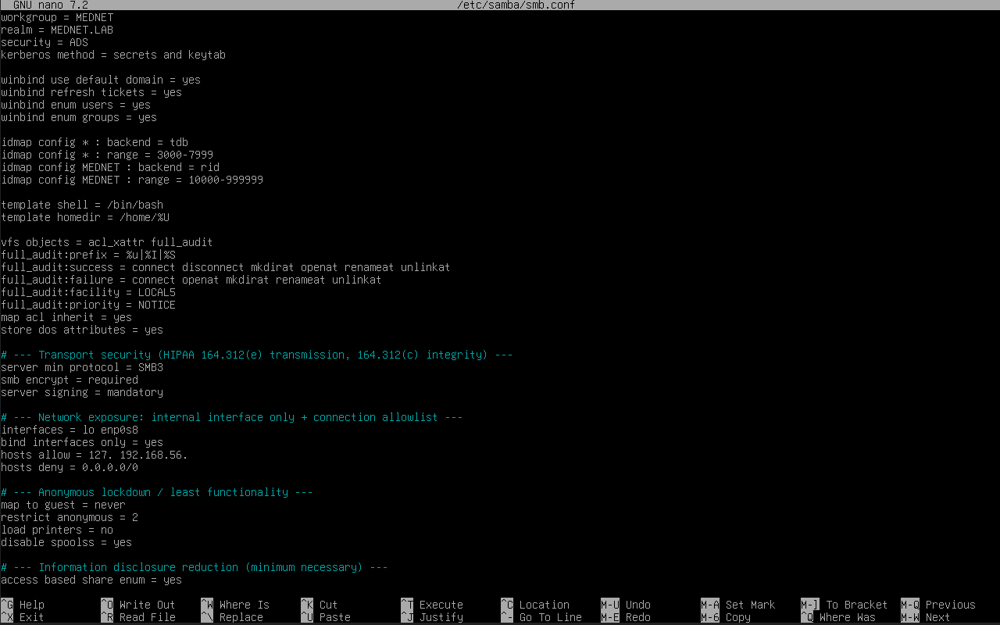
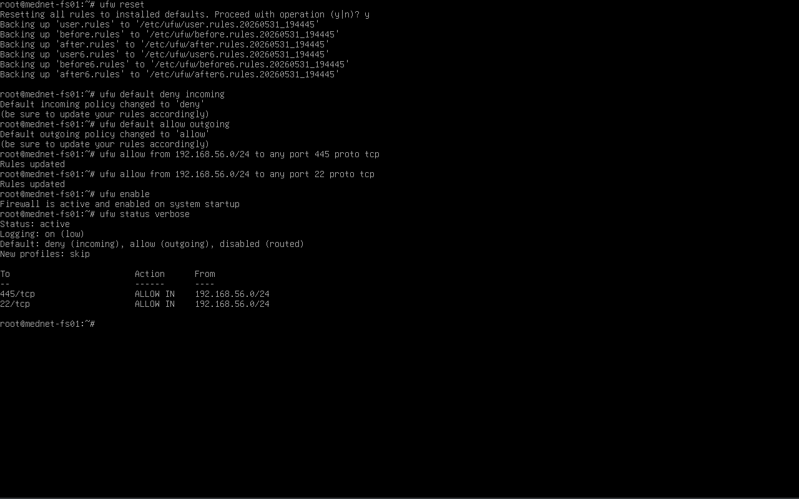
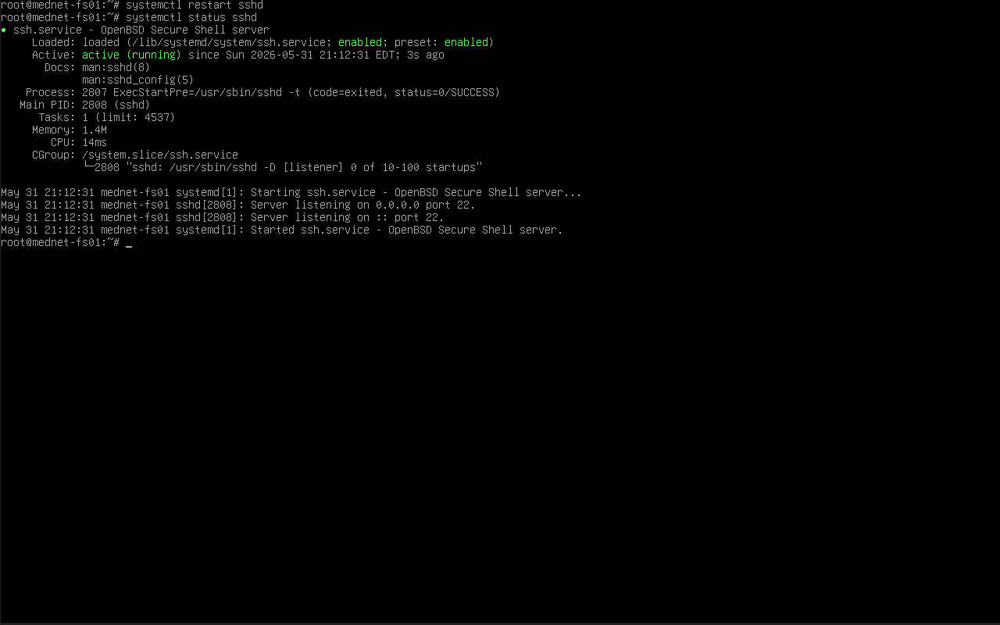

# 04 — Security Hardening

## Overview

This document covers the security hardening applied to `mednet-fs01` on top of the base Samba and domain-member configuration. Hardening addresses four areas: SMB protocol security, network exposure, the host firewall, and administrative access.

In a healthcare environment a file server falls under the HIPAA Security Rule's requirements for access control, audit controls, and transmission security. Each measure below maps to one of those areas and is summarized in the [Hardening Summary](#hardening-summary) at the end.

---

## Part 1 — SMB Protocol Hardening

The following directives were added to the `[global]` section of `/etc/samba/smb.conf` to enforce signed, modern, Kerberos-only SMB:

```ini
server signing = mandatory
client signing = mandatory
server min protocol = SMB2
ntlm auth = no
```

| Setting | Value | Security benefit |
|---|---|---|
| `server signing = mandatory` | mandatory | Every SMB packet must be cryptographically signed — defeats SMB relay and man-in-the-middle attacks |
| `client signing = mandatory` | mandatory | Enforces signing on connections this server initiates |
| `server min protocol = SMB2` | SMB2 | Refuses legacy SMB1 — removes the EternalBlue / WannaCry vulnerability class |
| `ntlm auth = no` | no | Disables NTLM, forcing Kerberos — closes off pass-the-hash credential attacks |

> **Why this matters in healthcare:** SMB relay and SMB1 exploitation are classic ransomware lateral-movement techniques. Mandatory signing directly mitigates relay; refusing SMB1 removes the vector behind WannaCry, which crippled hospital systems worldwide in 2017. Forcing Kerberos over NTLM eliminates pass-the-hash. These are baseline, non-negotiable controls for a server holding PHI.

That SMB1 is refused is also visible in the `smbclient -L` output in [02-share-structure.md](02-share-structure.md), which reports `SMB1 disabled`.



---

## Part 2 — Network Interface Binding

The file server has two adapters: `enp0s3` (NAT, for internet/updates) and `enp0s8` (host-only, the lab network `192.168.56.0/24`). Samba is bound to the internal interface only, so it never listens on or registers itself via the NAT adapter:

```ini
interfaces = lo enp0s8
bind interfaces only = yes
```

> **Why:** Without this, Samba listens on all interfaces and can register its NAT address (`10.0.2.15`) in DNS alongside its real host-only address — the exact dual-registration that caused Windows clients to hang trying to reach an unreachable address in [03-permissions-and-acls.md](03-permissions-and-acls.md). Binding Samba to `lo` and `enp0s8` only is both a reliability fix and a hardening measure: the file service is never exposed on the NAT side at all, shrinking the attack surface to the internal lab network.

---

## Part 3 — Host Firewall (UFW)

`ufw` was installed and configured with a default-deny inbound policy, permitting only the services the file server actually needs:

```bash
apt install ufw -y

ufw allow ssh
ufw allow 445/tcp
ufw allow 139/tcp
ufw allow 137/udp
ufw allow 138/udp
ufw allow from 192.168.56.0/24

ufw enable
ufw status verbose
```

| Port | Protocol | Service | Purpose |
|---|---|---|---|
| 22 | TCP | SSH | Remote administration |
| 445 | TCP | SMB | Primary Samba file sharing |
| 139 | TCP | NetBIOS Session | Legacy SMB-over-NetBIOS |
| 137 | UDP | NetBIOS Name | NetBIOS name resolution |
| 138 | UDP | NetBIOS Datagram | NetBIOS datagram service |

The default policy is **deny incoming, allow outgoing** — anything not explicitly permitted is dropped. The `allow from 192.168.56.0/24` rule scopes trust to the internal lab network.

> **Tightening note:** Because SMB1/NetBIOS is disabled (Part 1), modern SMB rides solely on TCP 445. The NetBIOS ports (137–139) are therefore not strictly required and could be removed — and `nmbd` disabled — to tighten the firewall further, relying on TCP 445 plus AD DNS for name resolution. They are documented here as configured; closing them is a reasonable next-step refinement.



---

## Part 4 — SSH Hardening

Direct root login over SSH was disabled so that all administrative access flows through a named account (`sysadmin`) that then escalates with `su`/`sudo` — producing an attributable audit trail for privileged actions.

```bash
apt install openssh-server -y
```

> **Note:** On this headless build the SSH *server* config (`/etc/ssh/sshd_config`) was not present until `openssh-server` was explicitly installed — only the client `ssh_config` existed. Installing the server package created the proper `sshd_config`.

In `/etc/ssh/sshd_config`:

```
PermitRootLogin no
```

Restart and confirm the service:

```bash
systemctl restart sshd
systemctl status sshd
```

> **Why:** Disabling root login removes the most-targeted SSH account and enforces accountability — every privileged action is tied to a specific human via their named account rather than the shared, anonymous `root`. This supports the HIPAA audit-control requirement.



---

## Verification

After applying all changes, the configuration was validated:

```bash
testparm                       # parses smb.conf; confirms signing/protocol directives are in effect
ufw status verbose             # firewall active, default deny incoming
systemctl status sshd          # SSH active (running) with root login disabled
systemctl restart smbd nmbd    # apply SMB changes
```

`testparm` should report a clean parse and show the hardening directives in the effective `[global]` configuration, with no weak-crypto warning.

---

## Hardening Summary

| Control | Implementation | HIPAA relevance |
|---|---|---|
| SMB signing mandatory | `server/client signing = mandatory` | Transmission security — prevents tampering and relay |
| SMB1 disabled | `server min protocol = SMB2` | Removes a known critical-vulnerability class |
| NTLM disabled | `ntlm auth = no` | Prevents pass-the-hash; forces Kerberos |
| Interface binding | `bind interfaces only = yes` (lo + enp0s8) | Limits exposure to the internal network only |
| Host firewall | UFW, default-deny inbound, SMB + SSH only | Access control — minimizes attack surface |
| Root SSH disabled | `PermitRootLogin no` | Audit control — privileged actions tied to named accounts |

---

## Future Enhancement — Audit Logging to SIEM

The next hardening layer is file-access auditing: enabling Samba's `full_audit` VFS module to log share access events (connections, reads, writes, deletes) and forwarding them to the Wazuh SIEM via a deployed agent. That turns the file server into an audited PHI repository with a centralized, correlated record of who accessed what — directly serving the HIPAA audit-control requirement. This is documented as part of the [MedNet-SIEM](../../05-MedNet-SIEM/README.md) module, where the file server is onboarded as a monitored log source.

---

## Related Documents

| Document | Description |
|---|---|
| [01-ad-integration.md](01-ad-integration.md) | Domain join, Kerberos authentication, and AD identity resolution |
| [02-share-structure.md](02-share-structure.md) | Share layout and the share-level `valid users` gate |
| [03-permissions-and-acls.md](03-permissions-and-acls.md) | POSIX ACLs and the cross-OS access demonstration |
| [MedNet-ActiveDirectory/04-security-hardening.md](../../01-MedNet-ActiveDirectory/docs/04-security-hardening.md) | AD-level hardening — account policies, audit configuration |
