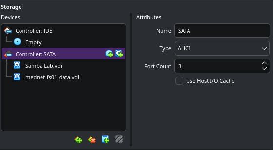
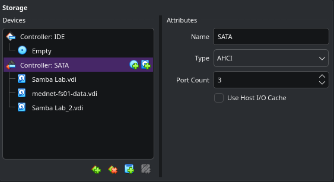

# Backup & Recovery

## Overview

This document covers how `mednet-fs01` protects the data held in the hospital share structure: the backup method chosen, how the backup target is isolated from the data it protects, the retention policy, the scheduled automation, and a full restore drill proving the backups are actually recoverable, not just present.

For a hospital file server, backup and recovery isn't a "nice to have" appended at the end of a build; it's a direct extension of the same *minimum necessary* and data-integrity thinking that shaped the share structure and permissions layers in the earlier documents. A share structure with correct ACLs is only as trustworthy as its ability to recover from accidental deletion, corruption, or disk failure.

---

## Objectives

| | |
|---|---|
| **Scope** | The Samba data tree at `/srv/samba` (the four category shares and everything beneath them). Configuration files (`smb.conf`, `/etc/restic`, this backup script) are protected implicitly since they live on the OS disk, which is a separate concern from this document. |
| **Out of scope** | Active Directory itself. `dc01` (`WIN-1UKKKVRDHPB`) is a domain controller with its own backup/recovery story (System State, AD database); duplicating that here would blur module boundaries. |
| **Recovery Point Objective (RPO)** | Up to 24 hours of data loss in a worst-case scenario, matching the daily backup cadence. |
| **Recovery Time Objective (RTO)** | Minutes for a single file or directory restore (demonstrated below); a full-volume restore would scale with data size but uses the same `restic restore` mechanism. |

---

## Method & Tooling

**restic** was chosen over a simpler `rsync`/`tar`-based approach for three reasons that matter specifically for a system holding PHI-adjacent data:

- **Encryption at rest.** Every snapshot is encrypted client-side before it touches the backup disk, so the backup target itself never holds plaintext data, which is relevant given the Clinical share's compliance posture.
- **Deduplication.** restic stores data as content-addressed blocks, so unchanged files across snapshots cost effectively nothing in additional storage. This is what makes daily backups sustainable long-term without the backup volume growing linearly forever.
- **Built-in retention.** `restic forget --prune` implements grandfather-father-son style rotation natively, rather than requiring a hand-rolled script to manage which old backups get deleted.

The tradeoff is a steeper learning curve than `rsync`, but for a system meant to demonstrate production-realistic thinking, restic more closely resembles what a real backup platform (Veeam, Bacula, Duplicati) provides.

---

## Backup Target

Backup storage lives on a **dedicated virtual disk, physically separate from both the OS disk and the data volume**, attached at `SATA Port 2`. Backing up to the same disk as the data it protects would mean a single disk failure could take out both the live share and the only copy of its backup, defeating the purpose entirely.

| Setting | Value |
|---|---|
| Disk | `mednet-fs01-backup.vdi`, 20 GB, fixed size |
| Device | `/dev/sdc1` |
| Filesystem | ext4 |
| UUID | `ca7ed732-dbed-4d61-9fe7-cc22e799b8fe` |
| Mount point | `/mnt/backup` (persistent, via `/etc/fstab`, referenced by UUID) |
| Repository path | `/mnt/backup/restic-repo` |

| Before: two disks (OS + data only) | After: dedicated backup disk attached |
|---|---|
|  |  |

The disk was partitioned with `parted` (GPT label, single partition spanning the full disk) and formatted `ext4`, then mounted persistently by UUID rather than device name. Device names like `/dev/sdc` can shift if disks are reordered or added, while a filesystem's UUID does not.

```bash
sudo parted -s /dev/sdc mklabel gpt
sudo parted -s /dev/sdc mkpart primary ext4 0% 100%
sudo mkfs.ext4 /dev/sdc1

sudo mkdir -p /mnt/backup
echo 'UUID=ca7ed732-dbed-4d61-9fe7-cc22e799b8fe /mnt/backup ext4 defaults 0 2' | sudo tee -a /etc/fstab
sudo mount -a
```

| Partition created & formatted | Mounted persistently via fstab |
|---|---|
|  |  |

> **Note:** In a production hospital environment, this backup target would live on separate physical hardware or offsite storage entirely, following the standard **3-2-1 backup rule** (3 copies, on 2 different media, with 1 offsite). A single-host VirtualBox lab can't reproduce true physical or geographic separation; this is a deliberate, documented limitation rather than an oversight. See [Limitations](#limitations--production-considerations) below.

---

## Repository Setup & Encryption

The restic repository is encrypted with a randomly generated password, stored in a root-only-readable file rather than typed interactively, which is what makes the backup scriptable and unattended later.

```bash
sudo mkdir -p /etc/restic
sudo bash -c 'openssl rand -base64 32 > /etc/restic/password.txt'
sudo chmod 600 /etc/restic/password.txt

sudo restic -r /mnt/backup/restic-repo init --password-file /etc/restic/password.txt
```


> **Note:** restic encryption is only as strong as the secrecy of its password. The password file is `chmod 600`, owned `root:root`, so no other account on the system can read it. Just as important: this password exists in exactly one place on this VM. If `mednet-fs01`'s OS disk were lost, the password would be lost at the same moment it's needed to unlock the backup, which would defeat the recovery entirely. In production this password would be escrowed in a secrets manager or password vault, separate from the server it protects. For this lab, the password was copied out to a personal password manager immediately after generation, outside of `mednet-fs01`.

With the repository initialized, a manual first backup confirmed the pipeline works end-to-end before any automation was layered on top:

```bash
sudo restic -r /mnt/backup/restic-repo backup /srv/samba --password-file /etc/restic/password.txt
```


---

## Backup Schedule & Retention

Backups run automatically via a script at `/usr/local/sbin/mednet-backup.sh`, scheduled through root's crontab.

```bash
#!/bin/bash
set -euo pipefail

REPO="/mnt/backup/restic-repo"
PASSWORD_FILE="/etc/restic/password.txt"
SOURCE="/srv/samba"
LOGFILE="/var/log/mednet-backup.log"

echo "=== Backup started: $(date) ===" >> "$LOGFILE"
restic -r "$REPO" backup "$SOURCE" --password-file "$PASSWORD_FILE" >> "$LOGFILE" 2>&1
restic -r "$REPO" forget --keep-daily 7 --keep-weekly 4 --keep-monthly 3 --prune --password-file "$PASSWORD_FILE" >> "$LOGFILE" 2>&1
echo "=== Backup finished: $(date) ===" >> "$LOGFILE"
```

The script is locked to root-only execution (`chmod 700`, `chown root:root`), consistent with the principle that anything capable of reading the entire share tree and holding the encryption password should not be executable by a standard account.

| Script created | Permissions hardened |
|---|---|
|  |  |

**Retention policy** follows a grandfather-father-son rotation: the 7 most recent daily snapshots, 4 weekly, and 3 monthly are kept, with everything else pruned automatically. This bounds repository growth indefinitely rather than accumulating snapshots forever, while still preserving meaningful recovery points spanning months, not just days.

Before scheduling, the script was run manually to confirm it works end-to-end: backup, then retention policy applied, with no errors:


**Scheduling:**

```bash
sudo crontab -e
```
```
0 1 * * * /usr/local/sbin/mednet-backup.sh
```

1:00 AM was chosen to align with the hospital's expected lowest-usage window, minimizing any I/O contention with clinical staff accessing shares during business hours.


To confirm cron actually triggers the script, not just that the syntax is valid, the schedule was temporarily set a few minutes ahead and observed:


The schedule was then set back to the real `0 1 * * *` production time.

---

## Restore Procedure

Restoring is done in two stages rather than restoring directly over live data:

1. **Restore to a scratch location** (`/tmp/restore-test`) and inspect the recovered content.
2. **Copy the verified file back** into its real path in `/srv/samba`.

This mirrors real incident-response practice: recovering into an isolated location first avoids the risk of an unverified or partially-corrupt restore silently overwriting good data still present elsewhere on the share.

```bash
sudo restic -r /mnt/backup/restic-repo restore latest --target /tmp/restore-test --password-file /etc/restic/password.txt
```

---

## Tested Restore

To prove the backup chain works end-to-end rather than just trusting that it should, a real file was deleted and recovered:

**1. Simulated deletion.** `intake-form-template.txt` was removed from `/srv/samba/clinical/physicians/`, simulating an accidental deletion (the most common real-world trigger for a restore).

**2. Restore to scratch location.** The latest snapshot was restored to `/tmp/restore-test`, and the recovered file's contents were confirmed to match the original exactly, while the live share was confirmed to still be missing the file (proving the restore didn't touch production data directly).


> **Note:** the restored files are owned `root:root` since restic ran under `sudo`; a non-root `ls`/`cat` against the scratch path correctly returns "Permission denied" until `sudo` is added. This is expected ownership behavior, not a restore failure.

**3. Restored to production path.** Once verified, the file was copied from the scratch location back into its real location on the live share.


This confirms the full loop: real data, real deletion, real recovery, verified byte-for-byte, restored to production.

---

## Limitations & Production Considerations

Consistent with this lab's approach of documenting constraints honestly rather than glossing over them:

- **No offsite copy.** The backup target is a second virtual disk on the same physical host as the data it protects. A real hospital deployment would replicate backups to a separate physical location, following the 3-2-1 rule, so that a single site-level event (fire, theft, host failure) can't take out both the primary data and its backup simultaneously.
- **Single password, single point of failure.** The restic encryption password lives in one file on `mednet-fs01`. Production use would escrow this in a dedicated secrets manager (e.g., HashiCorp Vault, a password manager with shared team access, or a sealed physical copy) independent of the server it protects.
- **No automated alerting on backup failure.** The script logs to `/var/log/mednet-backup.log`, but nothing currently notifies an administrator if a scheduled run fails silently. A production system would feed this log into the monitoring stack (see [`04-MedNet-NetworkMonitoring`](../../04-MedNet-NetworkMonitoring/README.md)) so a failed backup surfaces as an alert, not a surprise during an actual incident.
- **Single-server scope.** This backup protects `mednet-fs01` only. It does not cover Active Directory, other lab VMs, or hypervisor-level state; each of those would need its own backup story in a full production environment.

---

## Related Documents

| Document | Description |
|---|---|
| [01-ad-integration.md](docs/01-ad-integration.md) | Domain join, Kerberos authentication, and AD identity resolution |
| [02-share-structure.md](docs/02-share-structure.md) | Share layout, on-disk structure, and `smb.conf` share definitions |
| [03-permissions-and-acls.md](docs/03-permissions-and-acls.md) | POSIX ACLs, group-based read/write control, and the cross-OS access demonstration |
| [04-security-hardening.md](docs/04-security-hardening.md) | SMB signing, protocol hardening, firewall, and SSH hardening |
| [06-storage-and-quotas.md](docs/06-storage-and-quotas.md) | LVM storage layout and per-department disk quotas |
| [MedNet-ActiveDirectory/01-domain-design.md](../../01-MedNet-ActiveDirectory/docs/01-domain-design.md) | AD OU structure, security groups, and user accounts |

---

*Part of the [MedNet Enterprise Lab](../README.md), an Enterprise Healthcare IT Infrastructure & Security Operations home lab.*
