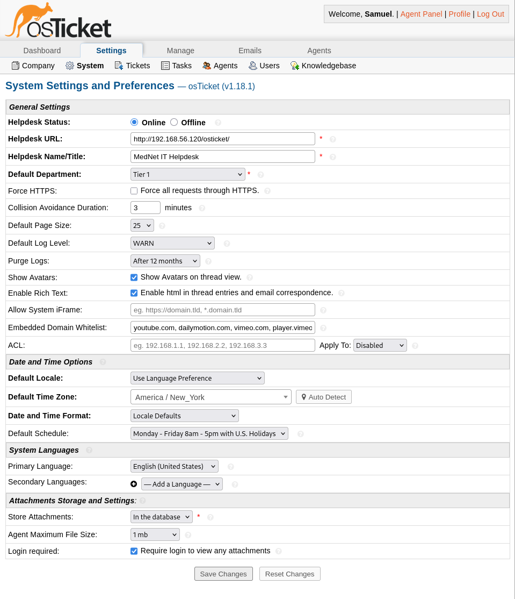
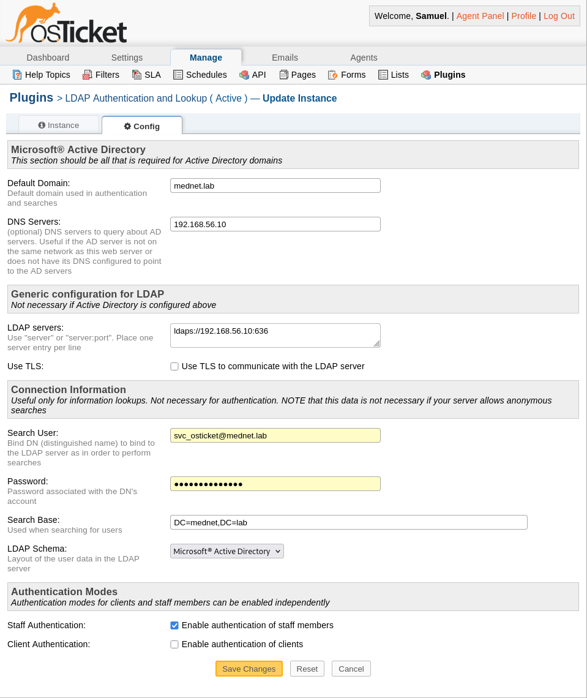
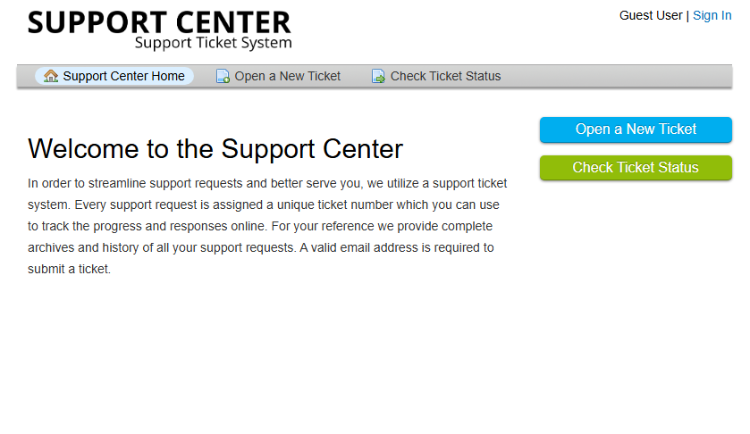

# Deployment & Authentication Integration — osTicket Helpdesk Lab

## Purpose

This document describes the deployment, baseline configuration, and Active Directory authentication integration of the osTicket helpdesk platform on Debian GNU/Linux 12. Together these establish a stable, secure, AD-integrated application suitable for internal enterprise use.

Deployment and authentication are documented together here because osTicket is not domain-joined — AD integration is handled entirely at the application layer via LDAPS rather than through host-level domain membership. Treating them as a single narrative better reflects how the system was actually built.

## Deployment Scope and Constraints

This deployment reflects a common **internal IT service desk** scenario, where the helpdesk platform operates within a trusted network and relies on centralized identity services rather than managing credentials locally.

Key constraints:
- Single-server deployment
- Internal-only access
- No public exposure
- Security-first baseline configuration
- Staff authentication delegated to Active Directory via LDAPS; the client-facing portal remains locally authenticated

The objective is operational clarity and stability rather than scale or high availability.

## Platform Selection

**Debian GNU/Linux 12 (Bookworm)** was selected based on:

- Long-term stability and predictable update cadence
- Native compatibility with PHP 8.2, required by osTicket
- Broad community and enterprise adoption
- Reliable availability of required PHP extensions (including IMAP)

Testing against newer distributions revealed dependency friction, reinforcing the importance of platform stability over novelty in production-style environments.

## Base System Preparation

The operating system was installed using a minimal server profile to reduce unnecessary services and attack surface.

Baseline decisions included:
- No graphical desktop environment
- SSH-enabled remote administration
- Immediate application of security and package updates
- Consistent hostname and DNS configuration

This approach aligns with standard enterprise server provisioning practices.

## Application Stack Deployment

The osTicket application stack was deployed using distribution-supported packages to ensure maintainability and security.

Components included:
- **Apache 2** as the HTTP service
- **PHP 8.2** as the application runtime
- Required PHP extensions for email processing, database access, and session handling
- **MariaDB** as the relational database backend

All services were configured to start automatically and verified for stability prior to application deployment.

## Database Configuration and Hardening

MariaDB was configured following vendor-recommended security practices.

Key decisions:
- Dedicated database created exclusively for osTicket
- Application-specific database user
- Least-privilege permissions
- Local-only database access

Database connectivity was validated prior to application installation to eliminate authentication or schema-related failures during runtime.

## Application Deployment

The osTicket application was deployed manually to maintain explicit control over file placement and permissions.

Deployment actions included:
- Downloading the official osTicket release
- Extracting files into the Apache web root
- Assigning ownership to the web service account
- Applying restrictive default file permissions

Configuration files were made writable **only for the duration of installation**, minimizing exposure.

## Initial Application Configuration

The osTicket web-based installer was used to complete initial application setup, defining the helpdesk identity, an initial administrative account, and database connectivity. Installer behavior was monitored via Apache error logs to detect and resolve runtime or permission issues.

The interim values entered during installation (helpdesk name, contact email, and access URL) reflected the lab's default network configuration at the time it was installed. These were subsequently realigned to the `mednet.lab` domain convention used across the rest of the environment — see System Configuration Alignment below.

## System Configuration Alignment

To keep the ticketing platform consistent with the rest of the MedNet environment, the initial installer defaults were updated post-deployment:

- **Helpdesk URL** — updated from the VirtualBox NAT adapter address to the host-only network address, `192.168.56.120` (`itsm01.mednet.lab`)
- **Helpdesk Name** — updated to reflect MedNet branding
- **Default System Email** — updated to a `mednet.lab` address

A DNS A-record for `itsm01.mednet.lab → 192.168.56.120` was added on the domain controller to support hostname-based access, consistent with the alias-record approach already used for `dc01.mednet.lab`.

## Active Directory / LDAPS Authentication Integration

Staff authentication is delegated to the MedNet Active Directory domain rather than managed locally within osTicket, consistent with the centralized-identity design established in the ActiveDirectory module.

Configuration was completed through osTicket's built-in LDAP/Active Directory plugin:

- **Default Domain:** `mednet.lab`
- **LDAP Server:** `ldaps://192.168.56.10:636` (the domain controller, `dc01.mednet.lab`)
- **Search/Bind Account:** `svc_osticket@mednet.lab` — a dedicated, least-privilege service account used only to bind and search AD, not a shared or administrative credential
- **Search Base:** `DC=mednet,DC=lab`
- **Authentication Modes:** Staff authentication enabled; client authentication intentionally left disabled

### Design Rationale

Two decisions here were deliberate rather than defaults left unexamined:

**Staff-only AD authentication.** Enabling AD authentication for staff ties every agent action in the ticketing system back to a real, centrally-managed domain identity, which matters for audit and accountability in a healthcare IT context. Client authentication was left disabled by design: patients and end-users interacting with the public support portal have no business need for a domain account, and requiring one would add friction and unnecessary attack surface without a corresponding benefit.

**LDAPS without the "Use TLS" option.** The LDAP server is defined using the `ldaps://` scheme on port 636, which negotiates TLS at connection time. The plugin's separate "Use TLS" checkbox controls STARTTLS, which applies to plaintext LDAP on port 389 — enabling it alongside an already-encrypted `ldaps://` connection would be redundant, so it was left unchecked.

The certificate trust enabling this LDAPS connection is established by the MedNet-RootCA; see [01-MedNet-ActiveDirectory/03-pki-and-ldaps.md](../01-MedNet-ActiveDirectory/03-pki-and-ldaps.md) for how that trust chain was built.

## Post-Installation Hardening

Immediately following installation, the application was hardened to prevent unauthorized reconfiguration.

Hardening actions:
- Removal of the osTicket setup directory
- Restriction of configuration file permissions to read-only
- Validation of application behavior after service restarts

These steps ensure the application cannot be reinstalled or modified without explicit administrative intervention.

## Deployment Validation

The deployment was validated through functional and operational testing:

- Successful access to the user ticket submission portal
- Successful staff authentication against Active Directory via the agent panel
- Successful access to the administrator interface
- Creation, processing, and resolution of test tickets
- Verification of service persistence across system restarts

Validation confirmed the platform was ready for service desk structure configuration (departments, help topics, and agent groups) and downstream monitoring integration.

## Baseline Snapshot and Change Control

Upon successful validation, the system was snapshotted to preserve a known-good baseline state. This snapshot serves as a rollback point and reference for future configuration changes.

Subsequent enhancements build upon this baseline rather than modifying it retroactively.

## Phase Completion Summary

At the conclusion of this phase, the environment met the following criteria:

- Stable and functional osTicket deployment, aligned to the mednet.lab naming and addressing convention
- Hardened baseline configuration
- Staff authentication integrated with Active Directory via LDAPS, using a dedicated least-privilege bind account
- Verified application and database operation
- Controlled and documented deployment process

This phase establishes the foundation for service desk structure, ticket workflows, and monitoring integration in later stages.
