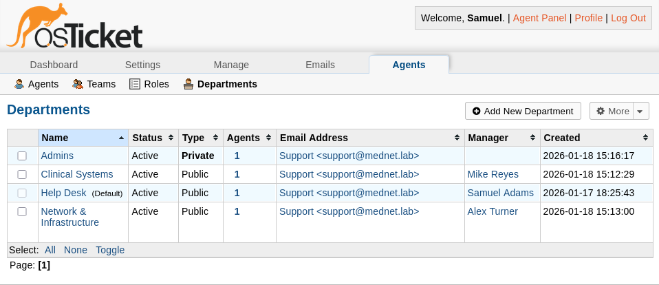
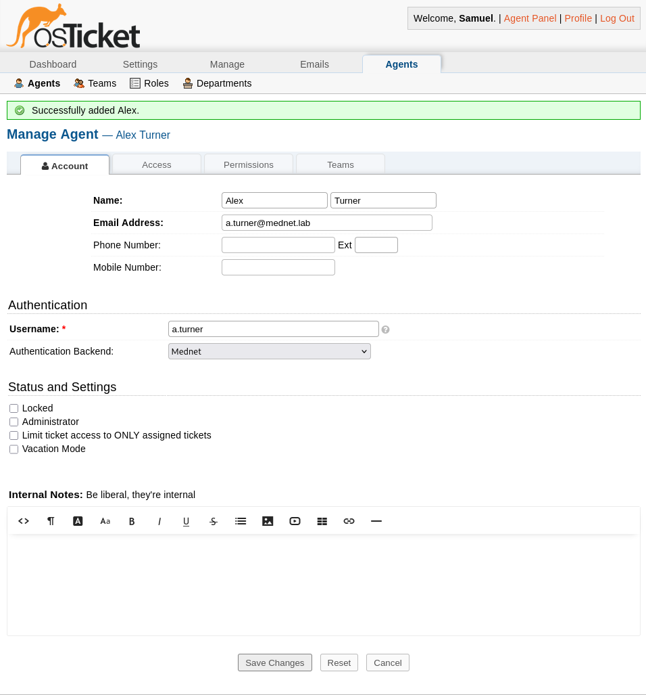
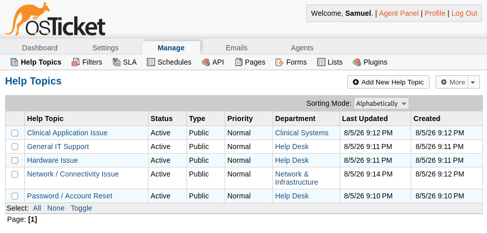
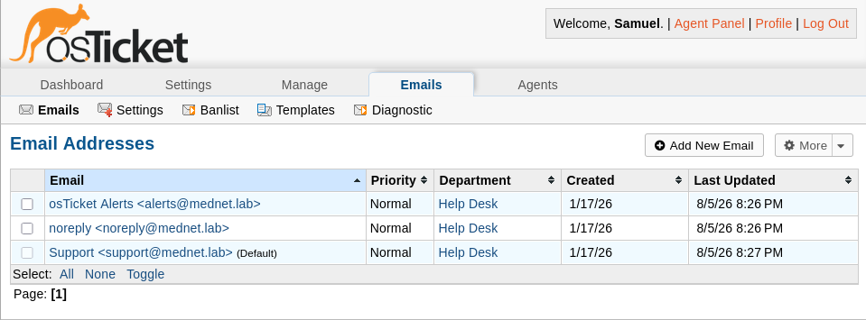
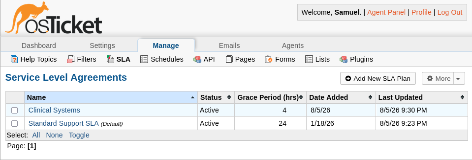

# Service Desk Structure

## Overview

This document describes the service desk structure built on top of the deployment and Active Directory authentication established in `01-deployment-and-authentication.md`: departments, agents, help topics, email routing, and service level agreements. Together these define how tickets are categorized, routed, and held to differentiated response expectations across the MedNet environment.

---

## Departments

Four departments were created to reflect the organizational structure of the ticketing system:

| Department | Type | Manager | Purpose |
|---|---|---|---|
| Help Desk (default) | Public | Samuel Adams | General intake: password resets, workstation issues, first-line triage |
| Network & Infrastructure | Public | Alex Turner | Connectivity, VPN, and infrastructure escalations |
| Clinical Systems | Public | Mike Reyes | Clinical application access and availability issues |
| Admins | Private | N/A | Holds the local break-glass administrative account, outside of AD |

osTicket requires at least one department to be Public. All three client-facing departments were ultimately set Public. Clinical Systems and Network & Infrastructure were briefly Private, but testing showed a Public Help Topic could not successfully route a ticket into a Private department, not merely have the department name masked from the client as the documentation describes. Admins remains Private, since nothing public-facing is ever meant to target it.

---

## Agents and Authentication

Each client-facing department is staffed by a single agent, authenticated against Active Directory rather than a local osTicket password:

- **Samuel Adams** (`s.adams`): Help Desk
- **Alex Turner** (`a.turner`): Network & Infrastructure
- **Mike Reyes**: Clinical Systems

All three use the **Mednet** Authentication Backend (LDAPS), the same configuration established during deployment. Every agent action traces back to a real, centrally-managed domain identity rather than a locally-managed one.

A separate local administrative account remains in place strictly as a break-glass fallback, isolated in the Private Admins department, in case AD or LDAPS is ever unavailable. It is not used for day-to-day ticket work.

---

## Help Topics

Five Help Topics route incoming tickets to the correct department automatically:

| Help Topic | Department |
|---|---|
| Password / Account Reset | Help Desk |
| Hardware Issue | Help Desk |
| General IT Support | Help Desk |
| Network / Connectivity Issue | Network & Infrastructure |
| Clinical Application Issue | Clinical Systems |

All five are Public, making them selectable in the client portal's ticket-creation flow. Network / Connectivity Issue was briefly created as Private, inheriting that status from its department at the time, and had to be corrected once the department was switched to Public. A Private Help Topic is only selectable by an agent creating a ticket internally, not by an end user submitting one through the portal.

---

## Email Routing

Three system email addresses are configured under the Help Desk department:

- `support@mednet.lab`: default outgoing/reply address
- `alerts@mednet.lab`: system alerts
- `noreply@mednet.lab`: automated notifications

Agent email verification (SMTP mailbox validation) was disabled at the system level. The lab has no outbound mail server and doesn't provision one, so verification failed for any address regardless of domain. This is a deliberate scope boundary rather than an oversight, consistent with the internal-only, no-external-dependency design established during deployment.

---

## Service Level Agreements

Two SLA plans reflect differentiated response expectations by department:

| SLA Plan | Grace Period | Schedule | Applies To |
|---|---|---|---|
| Standard Support SLA (default) | 24 hours | Monday-Friday, 8am-5pm with U.S. Holidays | Help Desk, Network & Infrastructure, Admins |
| Clinical Systems SLA | 4 hours | 24/7 | Clinical Systems |

The Clinical Systems SLA runs on a 24/7 schedule rather than business hours, reflecting that a clinical application outage affects patient care regardless of time of day, unlike a general IT request, which can reasonably wait for the next business day. SLA assignment happens at the department level, so every ticket routed to Clinical Systems inherits the tighter grace period automatically, without needing to be set per Help Topic.

Internal Notes on the Standard Support SLA record separate Response (4 hours) and Resolution (24 hours) targets, since osTicket's Grace Period field tracks a single overdue threshold rather than distinct response/resolution timers.

---

## Phase Completion Summary

At the conclusion of this phase:

- Four departments established, reflecting both the organizational and privacy boundaries of the environment
- All client-facing agents authenticate against Active Directory via LDAPS, consistent with the deployment phase
- Five Help Topics route tickets to the correct department automatically
- Email routing consolidated under a single support address, with verification intentionally disabled given the lab's scope
- Differentiated SLA plans in place, with clinical systems held to a tighter, always-on response standard

This phase establishes the foundation for ticket workflows and lifecycle management in the next stage.

---

## Related Documents

| Document | Description |
|---|---|
| [README.md](README.md) | Ticketing System module overview and documentation index |
| [01-deployment-and-authentication.md](01-deployment-and-authentication.md) | Debian/Apache/MariaDB deployment and AD/LDAPS authentication integration |
| [03-ticket-workflows.md](03-ticket-workflows.md) | Ticket lifecycle, cross-department escalation, and planned monitoring/SIEM integration |
| [04-security-and-backup.md](04-security-and-backup.md) | TLS encryption, agent authentication hardening, and tested backup/restore |

---

*Part of the [MedNet Enterprise Lab](../README.md), an Enterprise Healthcare IT Infrastructure & Security Operations home lab.*
