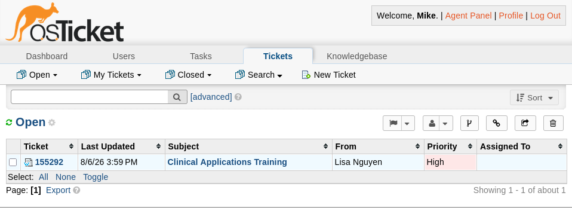
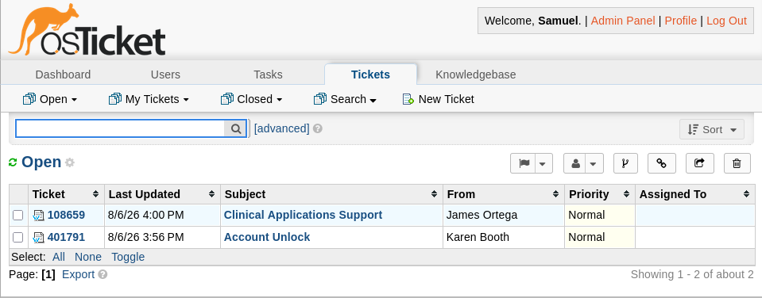
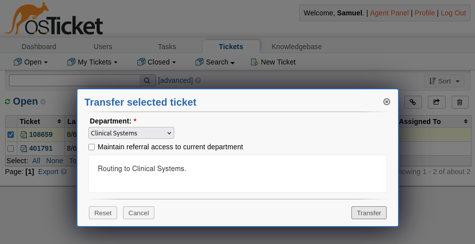
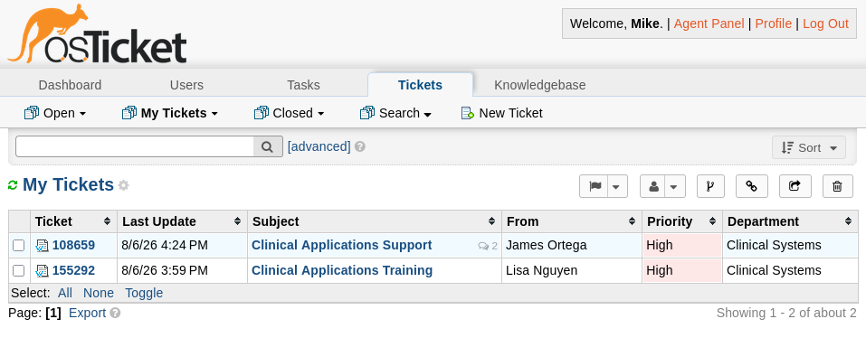
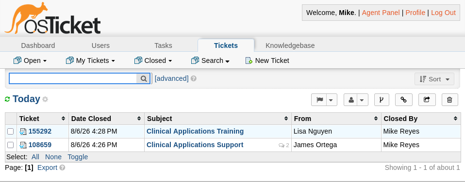
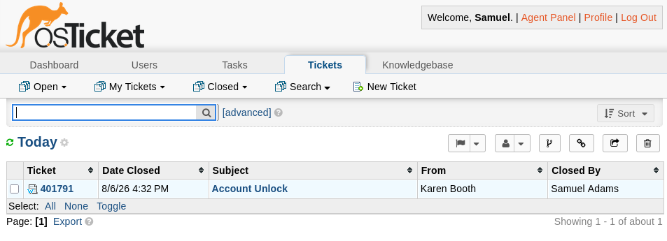

# Ticket Workflows — osTicket Helpdesk Lab

## Purpose

This document describes ticket lifecycle behavior built on top of the departments, agents, Help Topics, and SLA plans established in `02-service-desk-structure.md` — how tickets move from submission through resolution, how misrouted tickets get escalated between departments, and how the automated monitoring/SIEM intake path is designed to plug into this same lifecycle once it exists.

## Ticket Lifecycle

osTicket tickets move through a standard lifecycle: submitted (Open), claimed by an agent, worked through a mix of internal notes (staff-only) and public replies (visible to the submitter), then marked Resolved and finally Closed. Internal notes are used for cross-department coordination — for example, an agent flagging why a ticket is being transferred — without exposing that discussion to the end user.

## Validated Routing and Priority

A test ticket (`155292`, Clinical Applications Training) was submitted through the correct Clinical Application Issue Help Topic. It landed directly in the Clinical Systems queue at High priority with no manual intervention, confirming that the Help Topic's default priority — set during service desk structure configuration — actually takes effect at ticket creation.

## Department Escalation

A second test ticket (`108659`, Clinical Applications Support) was deliberately submitted under a generic Help Topic rather than Clinical Application Issue, representing a common real-world case: a user picks the wrong category, and an agent has to recognize and correct it. It arrived in Help Desk at Normal priority.

The Help Desk agent transferred the ticket into Clinical Systems using osTicket's built-in transfer dialog, with an internal note documenting the routing decision for whoever picks it up next.

### SLA behavior on transfer

The first transfer did not tighten the ticket's SLA to Clinical Systems' 4-hour grace period. Both SLA plans still had Transient left unchecked, based on earlier guidance to leave it off so an SLA wouldn't be "silently overridden." That reasoning didn't hold up against an actual escalation: a ticket that's supposed to tighten its SLA on transfer needs Transient enabled, not disabled. Both plans were updated and the ticket was re-transferred; the SLA updated correctly on the second attempt. Worth stating plainly rather than glossing over — the original guidance was wrong for this use case, and running the actual transfer is what caught it.

The ticket's priority was also elevated from Normal to High once it reached Clinical Systems — a manual judgment call by the receiving agent during triage, not an automated field change, since osTicket doesn't tie Priority to SLA or department transfer.

## Full Lifecycle Validation

Both Clinical Systems tickets were worked and closed by the Clinical Systems agent. A separate, non-escalated Help Desk ticket (`401791`, Account Unlock) was closed by the Help Desk agent to demonstrate the ordinary lifecycle path with no escalation involved.

| Ticket | Path | Final state |
|---|---|---|
| 155292 — Clinical Applications Training | Correctly routed via Clinical Application Issue topic | Closed, High priority |
| 108659 — Clinical Applications Support | Submitted under wrong topic, escalated Help Desk → Clinical Systems | Closed, High priority, SLA corrected on second transfer |
| 401791 — Account Unlock | Standard Help Desk request, no escalation | Closed, Normal priority |

## Monitoring and SIEM Integration (Planned)

Automated ticket creation from monitoring alerts is designed but not yet built — it depends on Network Infrastructure being completed first, with Network Monitoring and SIEM built together afterward. This section will be updated to reflect the real implementation once that work happens; until then, it documents the intended design:

- **Zabbix** (`mon01.mednet.lab`) — a Script-type media type action runs a script in `alertscripts/` when trigger conditions match, which POSTs the alert to the osTicket API.
- **Wazuh** (`siem01.mednet.lab`) — `wazuh-integratord` runs a custom script from `integrations/` per rules defined in `ossec.conf`, targeting the same API.
- Both converge on osTicket's `api/tickets.json`, authenticated with an API key scoped to just the `mon01`/`siem01` IPs — the same least-privilege pattern used for the `svc_osticket` LDAP bind account.
- Severity and source host determine department and priority (a Zabbix trigger on network hardware → Network & Infrastructure; a Wazuh alert on a clinical host → Clinical Systems), so automated tickets inherit the same routing and SLA behavior validated manually above.
- The API route was chosen over email piping deliberately, consistent with the lab having no outbound mail server — the same reason agent email verification was disabled during service desk configuration.
- Wazuh's default ruleset is noisy at low severity; the integration will need a minimum `rule.level` threshold so routine alerts don't flood Help Desk with low-value tickets.
- **Deduplication is a known open question, not yet solved**: a real implementation needs to check for an existing open ticket on the same host/rule before creating a duplicate. Called out honestly here rather than glossed over.

## Phase Completion Summary

- Ticket lifecycle from submission through Closed validated with three real test tickets
- Help Topic routing and default priority confirmed working as configured in Module 02
- Cross-department escalation via manual transfer validated, including a real SLA misconfiguration caught by testing rather than assumed correct
- Monitoring/SIEM automated intake designed but intentionally deferred until Network Infrastructure, Network Monitoring, and SIEM are built

This phase completes the ticketing system's core functionality. Remaining work in `04-security-and-backup.md` covers backup and security hardening for the platform.
