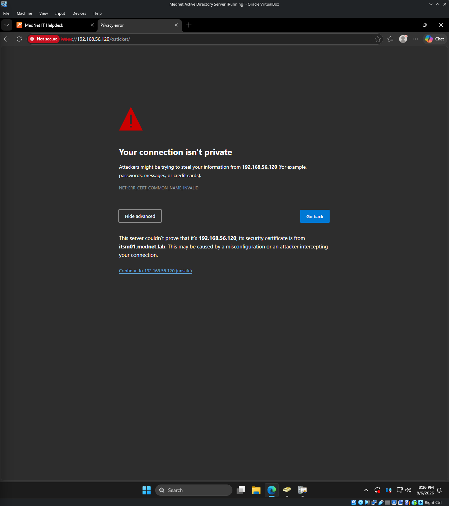
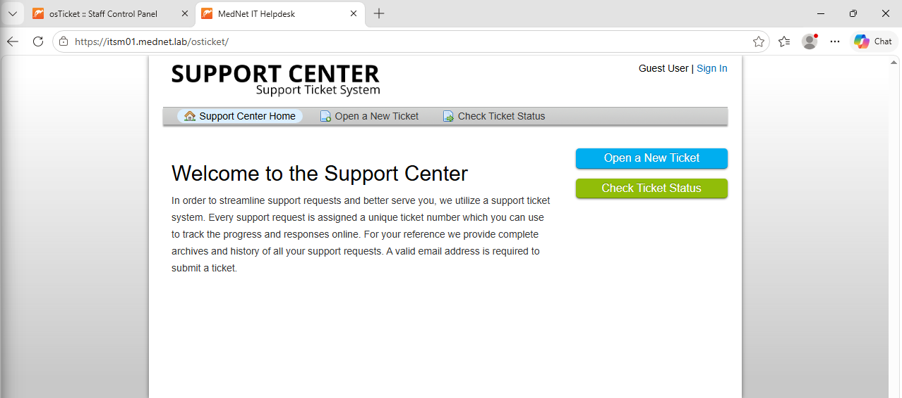
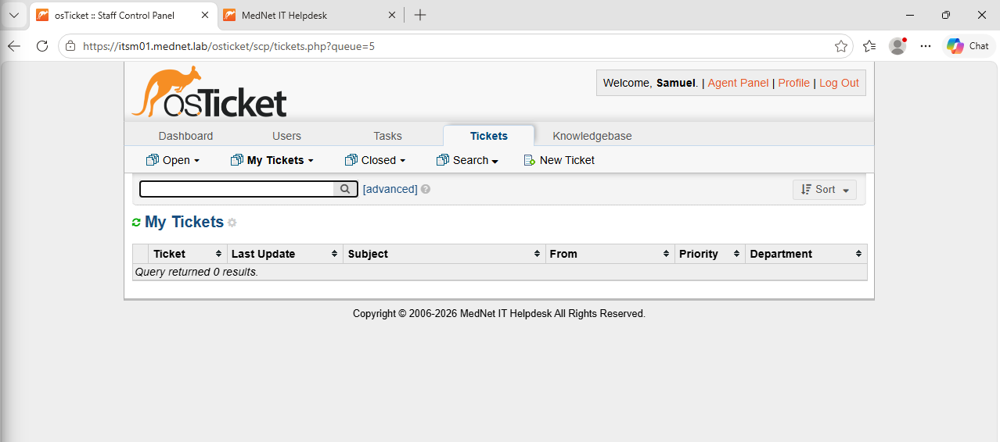
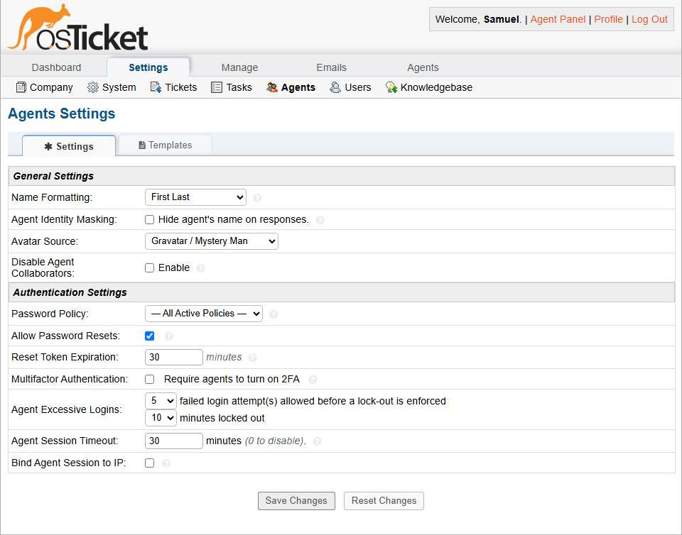

# Security & Backup — osTicket Helpdesk Lab

## Purpose

This document covers security hardening and backup/recovery for the osTicket deployment, building on the AD/LDAPS authentication established in `01-deployment-and-authentication.md` and the department/agent structure from `02-service-desk-structure.md`. It closes out the ticketing system module.

## TLS Encryption

The deployment was upgraded from internal-HTTP-only to TLS, using a certificate issued by the existing `MedNet-RootCA` rather than standing up separate PKI — the same CA already trusted domain-wide for LDAPS.

A CSR was generated on `itsm01` with an explicit Subject Alternative Name (modern browsers reject a certificate with only a CN, no SAN), submitted to the CA via `certreq` rather than the IIS Web Enrollment page — Web Enrollment was never installed alongside AD CS, since Module 01 only needed the CA for LDAPS, not browser-facing requests. The signed certificate and root CA cert were installed into Apache, `mod_ssl` enabled, and a dedicated `:443` vhost created pointing at the real `DocumentRoot`.

Getting to a working state surfaced several real, previously-undocumented issues, each fixed rather than worked around:

- **No DNS record for `itsm01.mednet.lab`.** The host had only ever been reached by IP; the A-record was simply never created. Added on the DC, same pattern as the `dc01` alias from Module 01.
- **`enp0s8` (the host-only interface) had no persistent configuration.** Its `192.168.56.120` address had apparently been assigned manually at some point and was never saved to a NetworkManager profile — it silently disappeared during unrelated DNS troubleshooting. Fixed properly with a persistent `nmcli` connection profile rather than reapplying the address by hand again.
- **The `IT` share's directory lacked the execute bit for other users.** Reading a file also requires execute (traversal) permission on its containing directory — the files themselves were readable, but the directory blocked reaching them. A narrow, deliberate fix (`chmod o+x` on the directory only, not a broader permissions change) resolved it without weakening the share's existing access restrictions, which were otherwise confirmed working correctly throughout this process.
- **A certificate CN/IP mismatch was caught correctly, not a bug.** When the Helpdesk URL was briefly set to the server's IP address instead of its hostname, browsers correctly refused the connection (`NET::ERR_CERT_COMMON_NAME_INVALID`) — the certificate was issued for `itsm01.mednet.lab` specifically, and the mismatch is exactly what certificate validation is supposed to catch.



Once the Helpdesk URL was corrected to the hostname, the certificate validated cleanly with no browser warnings, and Force HTTPS was verified to actually redirect plain-HTTP requests rather than just appearing enabled.





**Known, deliberately deferred item:** Firefox maintains its own certificate trust store separate from Windows, so it doesn't automatically trust `MedNet-RootCA` the way domain-joined browsers using the Windows store do. A real fix exists (Firefox's `ImportEnterpriseRoots` enterprise policy, typically pushed via GPO alongside CA distribution) but wasn't implemented here — noted as a known gap rather than silently worked around.

## Agent Authentication Hardening

Configured under Settings → Agents:

- **Agent Excessive Logins:** 5 failed attempts before lockout, 10-minute lockout duration (the maximum the dropdown offers natively)
- **Agent Session Timeout:** 30 minutes idle
- **Bind Agent Session to IP:** left off. Each agent currently works from a consistent, known workstation, which would make IP binding a reasonable fit — but the lab is still actively being built and tested, and binding now would add friction without a corresponding benefit at this stage. Worth reconsidering once the agent-to-workstation mapping is stable long-term.



## Security Posture Summary

Consolidating decisions made across this module rather than re-explaining them:

- Staff authenticate against Active Directory via LDAPS, using a dedicated least-privilege bind account (`svc_osticket`), not a shared or administrative credential
- Client authentication is intentionally not enabled — end users have no need for a domain account
- The local break-glass administrative account is isolated in a Private `Admins` department, separate from the AD-authenticated agent departments, and is not used for day-to-day ticket work
- Agent email verification (SMTP mailbox validation) is disabled, since the lab deliberately provisions no outbound mail server — the same constraint that shaped the API-over-email-piping decision for planned monitoring integration
- The deployment now runs over TLS with Force HTTPS enforced, using the existing MedNet-RootCA chain
- Agent accounts lock out after repeated failed logins rather than allowing unlimited brute-force attempts
- The `IT` file share's access restrictions were validated under real, unplanned testing during certificate installation — every permission wall encountered turned out to be the share correctly enforcing its design, not a misconfiguration

## Backup and Recovery

### Backup

Since osTicket attachments are stored in the database rather than the filesystem (confirmed in Module 02's System Settings), a single `mysqldump` captures the entire application state — no separate file-level backup is needed for attachments.

A backup script was written to `/usr/local/bin/osticket-backup.sh`, dumping and compressing the database with a timestamped filename, and pruning dumps older than 7 days. Because the script contains a plaintext database credential, it's restricted to root-only access (`chmod 700`), and the dump files themselves are similarly locked down (`chmod 600`) rather than left at the default world-readable permission.

Scheduled via root's crontab to run daily at 2 AM:
```
0 2 * * * /usr/local/bin/osticket-backup.sh
```

### Restore test

A backup that's never been restored is a hope, not a backup. A scratch database was created, the most recent dump restored into it, and the ticket count compared directly against the live database:

- Restored copy: **8 tickets**
- Live database: **8 tickets**

Exact match, confirming the dump genuinely contains complete, restorable data rather than just completing without error.

One useful side-finding during this test: the `osticket` database user could not create the scratch database itself (`Access denied`) — confirming the least-privilege database scoping from Module 01 is still correctly in effect. The MariaDB root account (via `sudo mysql`, unix socket auth) was used instead, with a temporary, narrowly-scoped grant on just the scratch database — revoked immediately after the test, along with dropping the scratch database itself, rather than leaving broadened access in place.

### Relationship to the Module 01 snapshot baseline

This is a deliberately different, complementary layer to the VirtualBox snapshot taken at the end of deployment. The snapshot is an infrequent, full-environment rollback point — useful for reverting the whole VM after a bad change, but not something you'd take daily. The `mysqldump` cron job is frequent, granular, and data-only — it protects against losing a day's worth of tickets without needing a full VM-level rollback. Together they cover different failure scenarios rather than duplicating the same protection.
